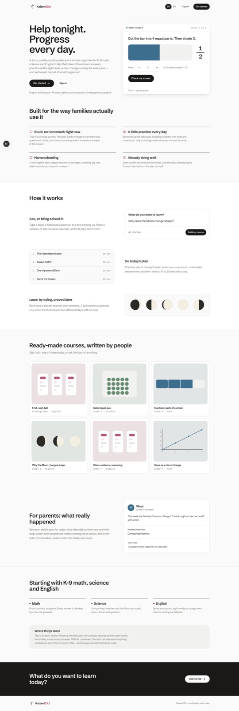
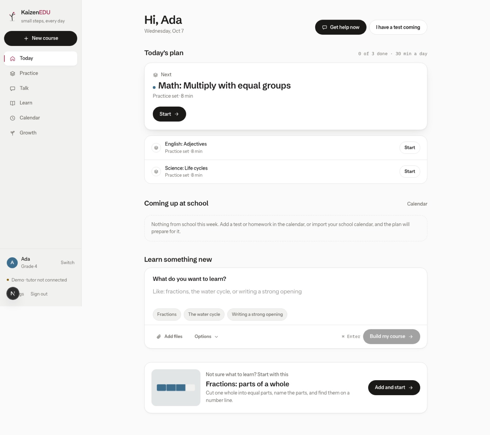
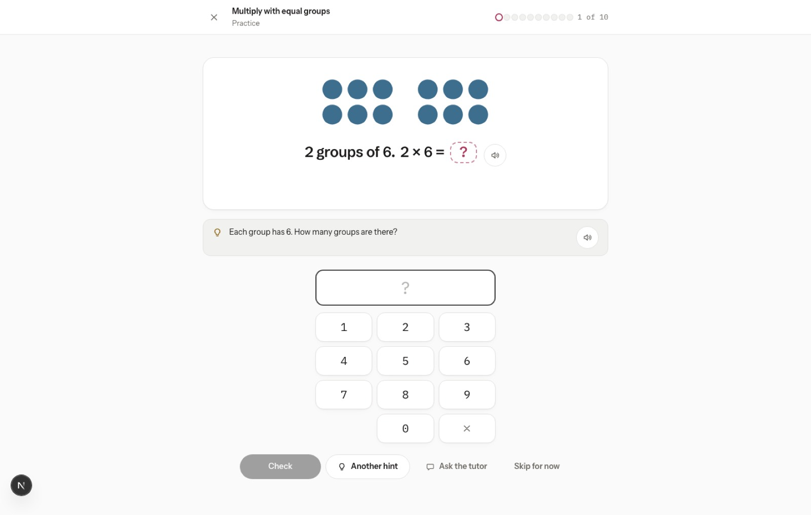
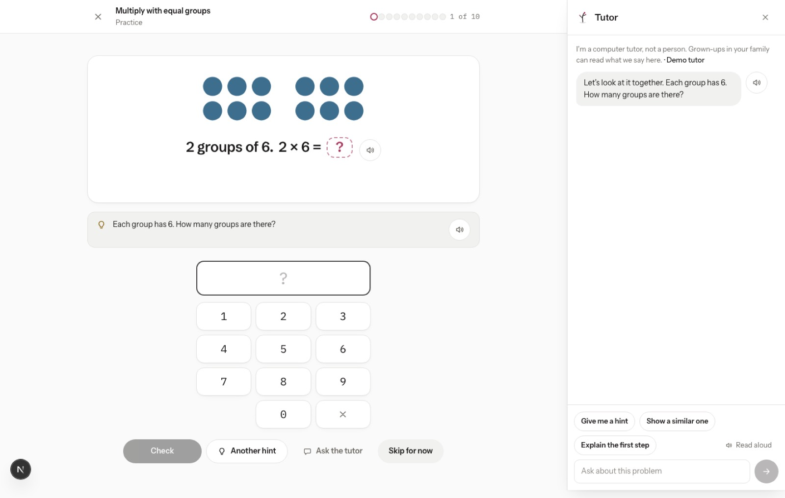
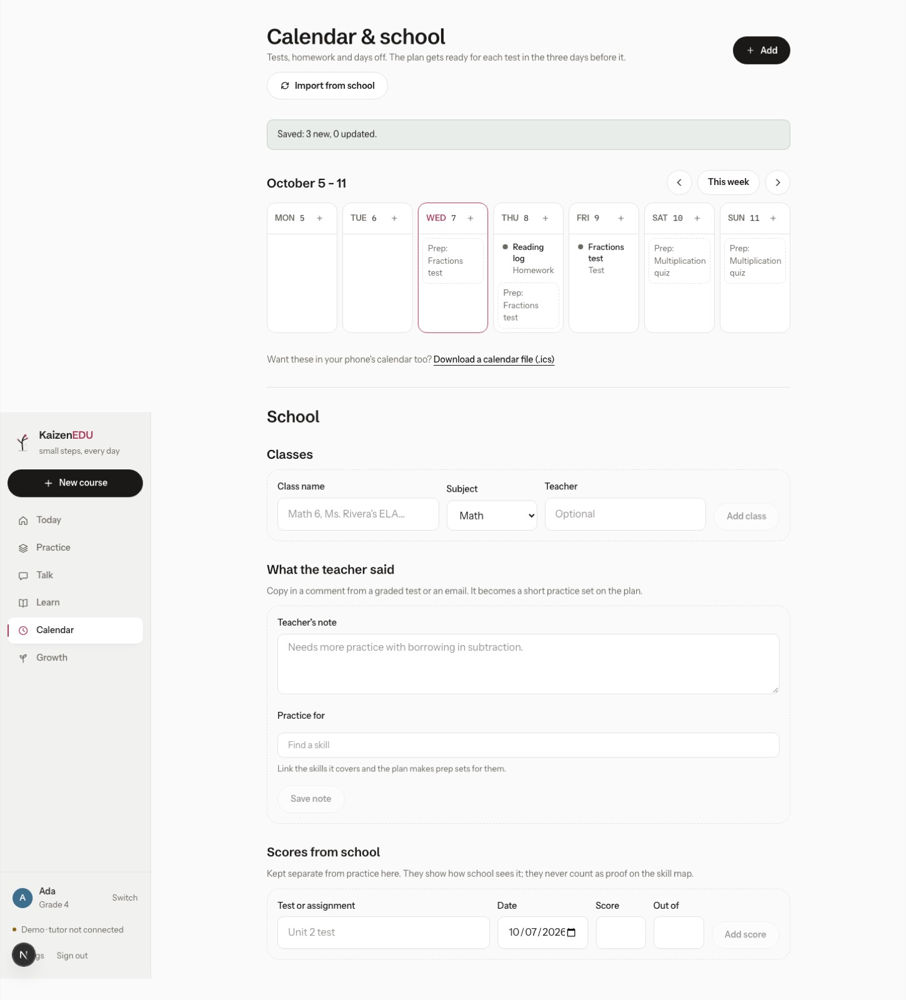
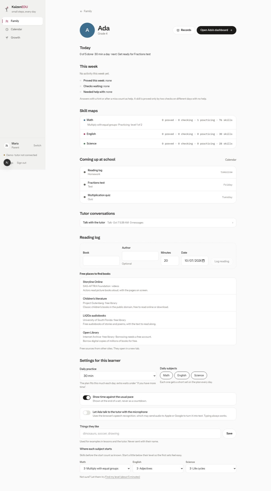

# KaizenEDU

A tutor, a daily practice plan and a school organizer for families. Starting with US students in
kindergarten through 9th grade in math, science and English (including rhetoric), with a parent view
that shows truthfully what happened. Final home: kaizenedu.net.

It serves four jobs in one product: **help right now** (homework, a test tomorrow), **daily practice**
(an at-home tutoring center), **homeschool** (skill maps, lessons, reading log, dated records) and
**staying on top** (school calendar import, test prep that schedules itself).

**Status:** works end to end in the browser on demo data. The AI tutor and lesson writer are built
and switch on when the deployment has an AI provider; without one, a demo tutor uses vetted hints and
worked examples. Server accounts, the database and the children's-privacy consent flow come next —
see [docs/ROADMAP.md](docs/ROADMAP.md) and [docs/STATUS.md](docs/STATUS.md).

| | |
|---|---|
|  |  |
|  |  |
|  |  |

Phone: [Today (K)](docs/screens/phone-today-k.jpg) · [a K practice set](docs/screens/phone-practice-k.jpg) ·
[Today](docs/screens/phone-today.jpg) · [Talk](docs/screens/phone-talk.jpg) · [records](docs/screens/phone-records.jpg)

## Run it

Requires Node 20.9+.

```
npm install
npm run dev
```

Open http://localhost:3000 → Get started → create a family account (stored only in your browser) →
add learners → pick what you want help with → open a learner's Today.

To turn on the AI tutor and lesson writer, put **one** of these in `apps/web/.env.local` (never commit
it) or in the Vercel project's environment:

```
ANTHROPIC_API_KEY=…            # Anthropic directly (preferred)
AI_GATEWAY_API_KEY=…           # or Vercel AI Gateway, Anthropic models only
KAIZEN_AI=gateway              # or, on Vercel, the deployment's own OIDC token through AI Gateway
```

Settings shows which one is live. `npm run verify` runs lint, type check, 724 unit tests and a
production build. `npm run e2e` runs six journeys and an accessibility audit at desktop and phone
sizes (`CI=1 npm run e2e` when a dev server is already running).

## What's here

| Path | What |
|---|---|
| `apps/web/src/practice` | The skill map (134 skills: 76 math, 30 English, 28 science, K–9, CCSS/NGSS codes), seeded problem generators with hint ladders and worked steps in EN/ES, a safe algebra parser and the answer checker. Every answer is checked by code. |
| `apps/web/src/learning` | The learning engine: skill status (practicing → check ready → passed one check → proved → needs a refresh), level stepping, review spacing, stuck and overdue flags, placement, set building. |
| `apps/web/src/planner` | Today's plan, calendar dates, `.ics` import/export, reading pasted school text, matching school words to skills. |
| `apps/web/src/lib/ai` | The tutor (prompts by grade band, tools, safety screen), the lesson writer with quality gates, AI practice, document reading, the family note. |
| `apps/web/src/resources` | Named free sources per skill and topic (PhET, Khan Academy, OpenStax, NASA, Project Gutenberg, Purdue OWL…), links checked. |
| `apps/web/src/catalogue` | Hand-written K–9 courses for the lesson stage. |
| `modules/` | Everything reusable from the earlier attempts — parked, not built. |
| `docs/` | Decisions, specs, plans, roadmap, status; `docs/history/` for earlier attempts. |

## The rules it keeps

- **Practice is not proof.** Answers are on your own, with help, or not yet. A skill is *proved* only
  by two short checks with no help available, on fresh problems, on different days at least six days
  apart, the first at least 48 hours after the last help.
- **Code checks answers; AI talks.** The tutor asks before telling, never gives a live answer before a
  try, and calls tools for hints, checking and worked examples. No answer key is in its prompt.
- **Safety before any model.** A crisis or abuse disclosure gets a fixed referral (988, Childhelp) and
  a note for the family. Names never reach a model. Transcripts are visible to grown-ups.
- **No engagement tricks.** No streaks to lose, no points, no "come back" nudges.
