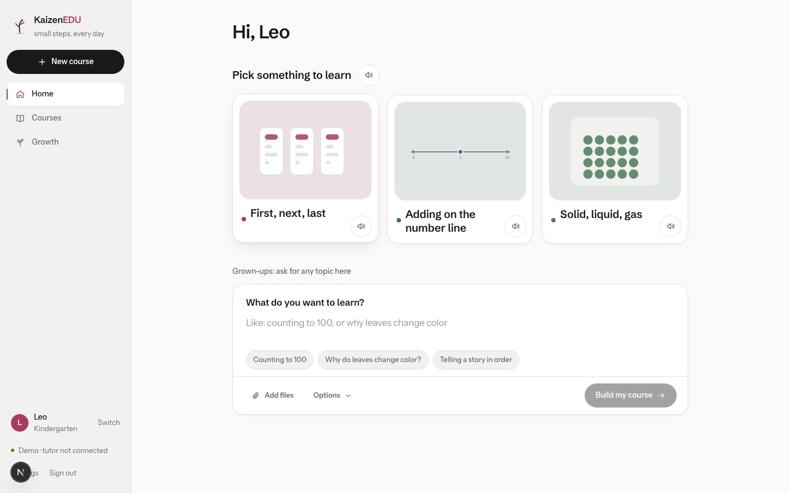
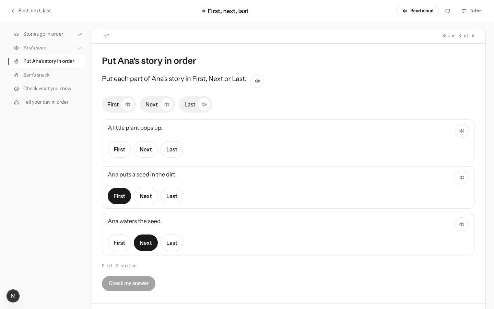
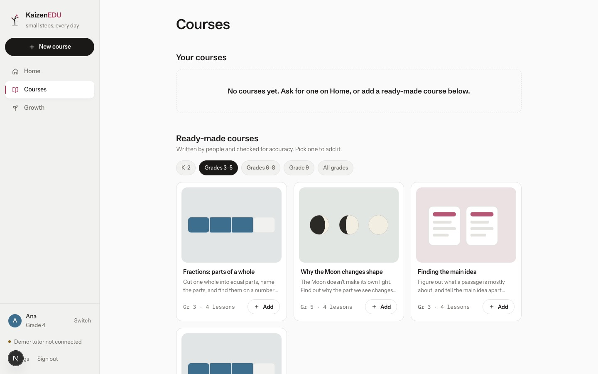

# KaizenEDU

Lessons a child can touch. Type what you want to learn; KaizenEDU builds a short course you see, move
and check — with a parent view that shows truthfully what happened. Starting with US students in
kindergarten through 9th grade, in math, science and English/rhetoric. Final home: kaizenedu.net.

**Status:** frontend foundation. Everything runs in the browser on demo data; the AI tutor, real
course writing (OpenMAIC) and server accounts come next — see [docs/ROADMAP.md](docs/ROADMAP.md) and
[docs/STATUS.md](docs/STATUS.md).

| | |
|---|---|
|  |  |
|  |  |

Phone: [landing](docs/screens/phone-landing.jpg) · [home](docs/screens/phone-home-kindergarten.jpg) · [lesson](docs/screens/phone-lesson-sorter.jpg) · [courses](docs/screens/phone-courses.jpg)

## Run it

Requires Node 20.9+.

```
npm install
npm run dev
```

Open http://localhost:3000 → Get started → create a family account (stored only in your browser) →
add a learner → ask the magic box for anything, or start a ready-made course.

`npm run verify` runs lint, type check, unit tests and a production build. `npm run e2e` runs the
family journey and an accessibility audit in a real browser at desktop and phone sizes.

## What's here

| Path | What |
|---|---|
| `apps/web` | The app: landing, accounts + learner profiles, student dashboard, magic box, course builder, lesson stage, Growth, parent Family view, Settings |
| `apps/web/src/catalogue` | Hand-written K–9 courses: 13 courses × 4 lessons, every lesson written (math, science, English/rhetoric; fractions also in Spanish) |
| `modules/` | Everything reusable from Kaizen-AI, KaizenEdu, trellis, the Hermes handoff and OpenMAIC — parked, not built |
| `docs/` | Product decisions, spec, plan, roadmap, status; `docs/history/` for earlier attempts |
| `PRODUCT.md`, `DESIGN.md` | Who it's for and how it looks |
| `AGENTS.md` | Rules for anyone (or any agent) working here |
