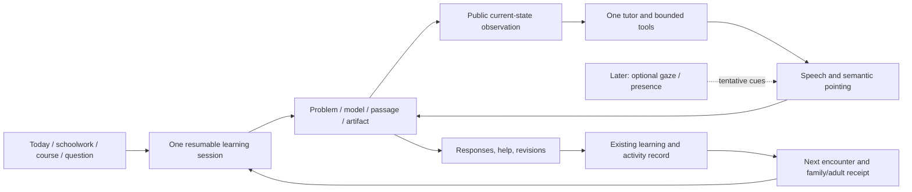

# One learning workspace

> **Proposed by Codex 2026-10-07. Not the plan of record. Mapped into STATUS Queue 4** (mostly Live
> Tutor phase B and polish batch 1; the mapping table is at the top of the
> [plan](../plans/2026-10-07-integrated-learning-release.md)). Reconciliation edits are marked
> *Reconciled 2026-10-07*. Items marked **OWNER DECISION** keep today's behaviour until the owner
> answers (STATUS lists each with its default). The mastery-law numbers do not change.

2026-10-07. Proposed product direction for the next build, written at the owner's request.
Ground truth: [system audit](../reviews/2026-10-07-system-audit.md).
Execution: [agent plan](../plans/2026-10-07-integrated-learning-release.md).
Model and speech selection: [models, voice and Jev](2026-10-07-models-voice-and-jev.md).

## 1. What we are making

A place where a person brings something they want to understand, works on it with a capable tutor,
and leaves more able to do something without that tutor. Schoolwork is the immediate use case.
The long-term product supports learning throughout life, including people who cannot rely on reading.

The owner clarified that this must be one fused system: a child-intuitive interaction with enough
technical depth for an adult. The same working objects, tutor, sources, tools and learning record
serve both. Age changes defaults and permissions; it must not be the ceiling on the learning space.
Helping children and helping adults are separate usability claims that both need testing.

The owner also explicitly wants future visual tutor presence and face/eye-tracking features to
improve the learning environment. The design below makes them extensions of shared attention.
It does not turn on a camera in the next release.

The owner further specified natural low-latency voice and a cohesive combination of visual styles,
animation, demonstrations, renders, hearing/speaking, touch and other human input devices. Visual
teaching carries the most weight; each channel supports the same lesson and action. Website
ornamentation comes later. Model selection is quality-first: “Max quality i will burn cash first
need best proof.” The separate model specification turns that into a comparison and evidence gate.

**The product promise:** bring the problem; find the next useful move; understand what changed;
know what to do next. The family should not have to assemble lessons, a chatbot, a practice site
and a calendar into a system themselves.

This direction updates the earlier “adults last” assumption: K–9 math, science and English remain
the reviewed curriculum focus, but the common workspace must demonstrate a substantive adult task
in this release. Adult breadth is not promised by a grade dropdown. “Camera off” remains today's
runtime default, with a separately evaluated opt-in sensing phase in §9.

*Reconciled:* reading the owner's "built with all in fusion" message as dropping "adults last" is
Codex's interpretation, awaiting the owner's confirmation (OWNER DECISION 16). Until answered, adults
stay last (PRODUCT.md): adult profiles keep working, the shared workspace is built so an adult task
can work, and the adult water-use story in §3 is a proposed acceptance story, not a release gate.

**Codex's implementation interpretation** *(moved here from DECISIONS.md, which keeps only the
owner's words; proposed for review)*: one durable session/workspace; independently adaptive support;
honest assistance/assessment provenance; reciprocal pointing and one voice owner; optional avatar/gaze
extension; independent benchmark shortlist followed by frozen, blinded role-specific model/voice
comparison, with bounded Jev roles. Coding success does not establish tutoring success. No
implementation or camera activation is implied by recording these decisions. Numeric mastery policy
is unchanged.

## 2. The decision, and the alternatives

| Approach | Benefit | Problem | Decision |
|---|---|---|---|
| Finish every existing feature package and add all content | More visible breadth | Repeats disconnected handoffs; expands the review burden | Recover useful work, do not treat package count as the release |
| Build a new immersive tutor app around voice/avatar | Strong first impression | Rebuilds the product, splits records, leaves reliability behind | Do not create a second app |
| Connect one durable learning session across existing tools | Makes the current investment useful together | Requires disciplined contracts and evidence repair | **Chosen** |

This is not a visual-theme reset. Keep the warm paper, ink, rose, type and interaction craft in
`DESIGN.md`. The bold move is a tutor that works on the same thing the learner does.

## 3. A session people can understand

The session has one goal and one active work surface. It can move through these activities without
making the learner navigate between separate products:

**Bring → inspect → try → explain/change → make something → try independently → leave a useful trace.**

That is a flexible teaching sequence, not a compulsory seven-step wizard. Someone who already
understands can start with a challenge. Someone with a question gets a helpful explanation rather
than an endless interrogation. A learner can stop, switch representations, or ask to go deeper.

### A concrete example: equivalent fractions

1. “Why is 1/2 the same as 2/4?” opens the workspace immediately. The original question remains
   visible. No course-length or subject form comes first.
2. One half-shaded bar appears. The tutor asks, “What do you think changes if we cut each part in two?”
3. The learner taps **Split each part**. The same shaded amount becomes two of four pieces. This
   action is observable state, not a text message claiming that a manipulation happened.
4. As the tutor says “the same amount,” a restrained underline or ring marks the shaded region.
   As it says “smaller pieces,” the marker moves to a subdivision. Nothing flashes across the page.
5. The learner can tap a label and ask “why this?” The tutor receives that semantic selection,
   the current bar and the learner's action history. It does not receive the hidden target/key.
6. **Show another way** places a number line beside the bar, linked to the same quantity. Moving
   one representation updates the other; the tutor explains the relation once.
7. **Make one** asks the learner to create another pair of equal fractions or an intentionally
   unequal pair and explain the difference. The construction and revisions are saved.
8. **Let me try** presents a fresh item with the previous demonstration tucked away. A correct
   answer is an independent attempt under the app's rules, not immediate proof of mastery.
9. The finish shows the learner's own construction, what was answered with help, the fresh attempt,
   and the next scheduled encounter. A parent sees the same facts in a short digest.

A teacher-reviewed version of this experience must work without an AI provider. Live AI adds
natural explanation and responsive teaching; it does not manufacture the correctness contract.

### Other acceptance stories use the same machinery

| Person and task | Shared work | Evidence of depth |
|---|---|---|
| Pre-reader building a quantity | Counters/place-value; spoken prompt; tap controls | Can predict, change the object and make an independent choice without typing |
| Spanish-speaking learner with homework | Fraction bar/number line; EN/ES vocabulary; typed or spoken response | Can ask about a specific part, self-correct speech and resume the same question |
| Older learner preparing for a test | Equation balance and graph; task-linked diagnostic | Can explain an invalid step and solve a changed problem, not just repeat a procedure |
| Learner evaluating an English argument | Short licensed/original passage; selected evidence spans; claim and revision | Can support a claim, distinguish evidence from opinion and revise with a reason |
| Adult investigating water use *(proposed; OWNER DECISION 16)* | Cited source plus a small numeric table/plot and editable assumptions | Can compare models, challenge the tutor and explain a held-out case without school or parental framing |

The science/adult case may use explicitly labelled sample data. It must not invent real measurements
or sources. Open explanations receive transparent feedback; they do not acquire a fake binary mastery key.

## 4. The interface

### The work is central

- The largest useful area contains the problem, diagram, passage, model or artifact. It stays visible
  while the tutor speaks. A transcript can be opened; it is not the default page composition.
- A compact tutor strip carries the current short instruction, microphone/typing control, stop,
  repeat and **Ask about this**. States are plainly named: ready, listening, working, speaking.
- One primary next action belongs to the learner. Contextual alternatives include **Another way**,
  **Let me try**, **Go deeper**, and **Done for now**. Do not show every option simultaneously.
- Sources, previous work and conversation live in disclosures or a side panel, with a return to
  the current object. The learner can revisit an earlier representation without losing their answer.
- On phones, the tutor occupies a compact bottom area, never an 80dvh overlay during explanation.
  The soft keyboard must leave the relevant work/answer visible. Scrolling never steals input focus.

Routes remain useful entrances: Today chooses work, Calendar supplies real deadlines, Learn supplies
ordered courses, Practice supplies skills, Talk accepts open questions. Each opens or resumes the
same session context. Existing deep links remain valid. The next release does not need a new top-level
route or a wholesale shell rewrite.

### Adaptation is explicit and reversible

Keep `Profile.grade` for curriculum and age-appropriate defaults. Add independent preferences:
guidance (`guided | standard | concise`), reading support (`on | on-request`), input preference
(`touch | text | voice`), and pace (`stepwise | continuous`). These are user-controlled preferences,
not diagnoses or inferred fixed learning styles. Capability/permission determines available inputs.

Young defaults: picture first, one short direction, optional spoken opening after an explicit start
gesture, 56px targets and no required typing. Adult defaults: concise wording, standard 44px targets,
editable assumptions, source access and deeper questions. Any person can request more guidance or
less reading. UI copy for an adult must not refer to “your grown-up.”

Do not equate slow interaction, gaze away, accent, a wrong answer or repeated help with low ability.
Offer a different representation or a pause; record only the observed action and its outcome.

## 5. One session, several kinds of evidence

The session is a small orchestration layer around existing domain functions. It is not a second
mastery engine, a generic workflow platform, or a transcript in which the model invents state.

| Record | Meaning | Who can establish it |
|---|---|---|
| Activity | Read, manipulated, discussed, built, revised | Local/domain action with source and time |
| Assisted performance | An answer after a hint, explanation, retry or relevant demonstration | Durable help/exposure ledger + checker |
| Immediate independent attempt | Fresh response without recorded in-app help on that attempt | Frozen attempt and valid help history; does not bypass the delayed law |
| Delayed verified check | Issued questions meeting the existing policy and trusted provenance | Server assessment path only for synced accounts |
| Open artifact/feedback | Original explanation, model, counterexample or draft | Learner artifact + attributed rubric feedback; never auto-promoted to “proved” |
| School result | A reported external grade/result, with who supplied it | School import or explicit parent/learner entry; not proof of causation |

Keep the current mastery law numbers: readiness 9/10 at top level; checks 4/5; two qualifying checks
on different days at least six days apart, each at least 48 hours after help; reviews on the existing
schedule. Read `learning/engine.ts` as authority for all constants. The plan repairs enforcement;
any change to policy, including accommodations or new attempt validity rules, must be explicit.

*Proposed by Codex (see the reconciliation below):* “Tutor present” and “tutor helped” become different facts. Neutral read-aloud/navigation and a
visible tutor do not supply a hint; content-bearing explanation or pointing that reveals a solution
does. That is the explicit assistance policy proposed by this design; it changes no numeric rule.
Reading assessment
must declare whether narration changes the skill being measured. Until a reviewed rule exists,
that supported attempt remains practice-only rather than guessing its validity.

*Reconciled 2026-10-07:* both proposals change what counts as an independent answer, which feeds the
mastery law's 48-hour quiet period and the assisted flag (AGENTS.md rule 9's spirit), so both are
owner decisions. Current semantics stand until the owner answers:

- **OWNER DECISION 4** — "opening a tutor is neutral". Default: opening the tutor on a problem
  counts as help, as today (`TutorDrawer` marks the problem helped when opened; a visible stage tutor
  marks the work helped).
- **OWNER DECISION 6** — "read-aloud-supported checks are practice-only". Default, as today:
  read-aloud is not help for any skill (`Runner.tsx` `helped` and the stage's `QuizView` never count
  it), and read-aloud-supported checks count, so pre-readers can prove skills. Whether read-aloud
  should count as help for skills that measure reading itself is the open part of the question;
  nothing is built for it until the owner answers.
- **OWNER DECISION 5** — whether an unassisted wrong first answer starts the 48-hour wait. Default:
  no, as today.

Explicit help events (saved before help is shown) are still the right mechanism; they make today's
conservative rule durable across reload rather than replacing it.

Hints and first responses are recorded when they happen, before more teaching is delivered. Reload,
another tab, switching inputs or another device must not erase help. A check requesting content help
ends that independent attempt before assistance begins. No UI flag can force `assisted=false`.

## 6. Exact boundaries the implementation must preserve

### Session and observation

- One durable `LearningSession` links goal, origin, learner, existing set/course/thread/event IDs,
  active work object, phase and return target. Stable object IDs and revisions bind observations.
- A typed **public observation** includes only the current visible prompt, selected source spans,
  rendered quantities, learner input and action history needed for the reply. Construct it field by
  field. Never spread `Item`, `Widget`, quiz or store objects into a prompt: they contain keys.
- Work objects expose bounded actions through adapters. Reuse existing checkers and widget renderers.
  The model cannot run JavaScript, select arbitrary DOM, navigate to arbitrary URLs or write evidence.
- The learner's input and a model tool call have different authority. A spoken answer must become
  a confirmed learner submission through the same command used by the answer pad.
- Session commands carry IDs for idempotency and revision checks. A stale reply can be retained as
  history, but cannot speak, move attention or change the new object.
- Meaningful learner edits invalidate the old response epoch. Presentation/animation frames do not
  change semantic revision. An accepted tutor demonstration advances revision atomically and returns
  a new anchor for its continuation; a conflicting learner edit still interrupts it.

### Shared attention

- Use the existing spotlight registry/guards. Each visible concept part has a semantic target ID,
  short accessible label and public state. Register targets in the current session/object only.
- The tutor's cue is bound to session, object revision, reply and audio run. Validate when parsed
  and again when executed. Targets distinguish `learnerSelectable` from `tutorPointable` by current
  attempt state. A learner can select visible options; solution-revealing tutor guidance follows
  the assistance gate. Hidden keys, hidden panels and unrelated profile data are never targets.
- Cues follow speech timing where supported, sentence timing otherwise. If timing is unavailable,
  hold one relevant cue; do not simulate word precision with an arbitrary timeout.
- The learner can select the same semantic target with tap/keyboard and ask about it. A future
  gaze candidate can suggest that target, but never silently submits a learner question or answer.
- No cursor steals keyboard focus, changes an answer, or chases the learner's eyes. Reduced motion
  uses a static mark. Screen readers receive the relevant short text equivalent without speech spam.

### Voice

One app-level audio owner handles tutor speech, narration and read-aloud. One logical learner turn has
one authoritative teaching chain, one active delivery stream and one confirmed answer submission.
Internal tool/model requests share turn identity, cancellation, provenance and budget.
Barge-in, stop, route/learner switch,
hidden tab and permission revoke cancel outstanding speech/cues and stop microphone tracks.
Only the heard prefix of an interrupted response is described to the next tutor turn as delivered.
Displayed text and played audio have separate delivery events. Native voice must pass the same
authorization, committed-input screening and help-before-release rules as cascaded speech; an adapter
that cannot enforce them remains evaluation-only. *Reconciled:* native speech-to-speech cannot screen
or name-scrub audio before the model hears it, so it is evaluation-only on synthetic or
consenting-adult audio; for minors the production path is the cascade (recognizer → safety screen →
name scrub → model → speech output; OWNER DECISION 3, default: cascade). Latency gates are the
live-tutor spec's §2.3, including the K–2 band. Server/provider revocation and outstanding token
lease lifetime are tested separately from immediate cancellation on a cooperating client.

Typed/tap interaction is always available. An uncertain recognition is shown for confirmation;
silence, partial recognition and self-correction are not wrong answers. Browser speech, vendor speech
and no-speech modes have truthful state and matching functional fallbacks. Model/vendor names in old
specs must be verified before implementation. No key is needed to build deterministic mock coverage.

Natural voice is a release capability, with interruption and measured end-to-end delay. A fast
greeting does not count as a fast useful answer. The model specification defines proposed latency
targets and device/EN/ES audition. Start with tap-to-talk; hands-free uses the same controller.

### Visual, sound and human input form one interaction

A teaching beat binds a current object, the intended learner action, a visual transition, optional
speech and any attention cue. Splitting a fraction animates the actual partition state; it does not
play an unrelated celebratory clip. The learner can pause/replay and inspect before/after states.
Sound reinforces meaning without making silent use incomplete. Warmth, rhythm and surprise are
designed teaching choices, not claims that the system knows the learner's emotional state.

Use browser pointer events for mouse, touch and stylus-as-pointer, keyboard controls and accessible
names/actions for assistive devices. Selection, adjustment and confirmed submission all enter the
same semantic command path. No drag-only work, voice-only answer or custom device permission is
required. Later handwriting, switches or other HID can add adapters without another learning record.

### Sources, artifacts and model authority

Add a bounded artifact record for a learner-created construction, claim/evidence response or numeric
table/plot, with revisions and provenance. Save work the learner actually changed; do not silently
replace it with the tutor's polished output. A model suggestion stays a suggestion until accepted.
Source excerpts carry URL/title/version or retrieval time and item-level permission/provenance.
“Linked to a source,” “teacher reviewed,” “computed,” and “AI written” are separate properties.

## 7. Scope of the next integrated release

The release is bounded by capabilities, not an age-exclusive product.

**Included:** existing baseline repairs; durable help and valid checks; shared session across current
routes; live widget/quiz observations; reciprocal attention; one voice owner; deterministic linked
representations; one saved artifact/revision flow; task-linked Today/continuation; truthful learner,
adult and family receipts; production identity/consent/spending/export/delete gates; cross-age EN/ES
acceptance journeys. Current capabilities continue to work while each change is integrated.

**Depth demonstrations:** the five stories in §3, built from reviewed existing content wherever
possible. The only new general teaching object is a bounded numeric table/plot (maximum 50 rows,
four numeric columns; declared units; no arbitrary code). Two linked representations of an existing
quantity and a claim/evidence annotation reuse present visuals and native text inputs.

**Not required to finish this release:** all content-merge packages, full OpenMAIC editor parity,
an adult curriculum catalogue, teacher marketplace, school write-back, social network, payment system,
photorealistic avatar, live gaze capture, generative video or arbitrary generated interactive code.
These remain deliberate future work. The source/asset review burden must not grow faster than the
ability to verify what one learner sees.

*Reconciled:* content-merge is not held back. It merged behind the existing "Draft questions" labels
once its tests were green (Queue 4 #1, d34f845; holding it was OWNER DECISION 8, default: merge as
you go); review decides what is labelled reviewed, not what merges. Full OpenMAIC parity and then beyond stays
the long-term principle (PRODUCT.md Principle 5); this release carries a narrower scope.

Three internal checkpoints serve the single release:

1. **Trust the work:** repair evidence, ownership and existing journeys.
2. **Use it as one tutor:** shared work, attention, voice, creation and continuation, locally/demo.
3. **Put it in families' hands:** production gates, reviewed content, real-device evaluation and
   observed use. Checkpoint 2 is not mislabeled a live-family launch.

## 8. Engagement that produces something

The product should offer anticipation, agency and visible competence:

- **Predict before revealing:** a short prediction, then a manipulation that makes the consequence
  visible. Do not add a question before every action; use it where an outcome can surprise or clarify.
- **Change one thing:** keep the learner's model, change one condition and ask what stays true.
  This supports curiosity and transfer without generating another entire course.
- **Teach it back / catch my mistake:** inspect a bounded, intentionally wrong example and repair it.
  The tutor labels the exercise as a deliberate mistake; it does not pretend a real error is a trick.
- **Make something worth keeping:** an example, explanation, tiny investigation or practical model.
  The learner's own artifact is the finish screen's focal point.
- **Leave a question for next time:** save the learner's question beside the work and use it as an
  optional continuation. No fabricated cliffhanger or guilt about returning.

These are hypotheses about a better learning experience, not proven retention mechanisms. Future
game elements are allowed when they serve an explicit learning goal and their effect is measured.
Do not silently inherit categorical bans from an unfinished panel document. Do not optimize session
length or streak preservation as a substitute for learning. *Reconciled:* the panel document is
finished: the learning loop is now the 1.0 plan §2.10 (revised to the owner's engagement rules and
checked, `foundation` 7327802), and it is the authority for engagement mechanics.

The shadow work is concrete: preserve the problem, connect it to a skill when justified, arrange
practice around a real deadline, schedule the next encounter, keep overdue tasks visible and produce
a brief account. It must explain why a recommendation appeared and let the person change it.

## 9. Future tutor presence and sensing

Treat **tutor embodiment**, **learner sensing**, and **educational evidence** as separate capabilities.
They connect through the same session, but granting one does not grant the others.

### 9.1 A visible tutor

Later add an optional restrained face/avatar with gaze direction, speech timing and turn-state cues.
It looks toward the same semantic target the tutor is explaining; it acknowledges the learner's turn
without covering the work. It is another renderer of current tutor state, not another agent.
It works with the learner's camera off. Start with a simple authored face, compare it with the existing
mark, and keep it only if people find the interaction clearer or more comfortable. No claim that a
face is necessary, human, emotionally aware or a substitute for human relationships.

### 9.2 Optional face presence and gaze

Evaluate coarse gaze-to-region assistance first: diagram versus source versus answer area. A learner
looking away may be thinking, reading paper, managing glare or taking a break. The response can be
“Want me to point it out?” or a user-enabled pause-and-resume aid, not “You are distracted.”

Proposed future flow: explain the specific use → separate opt-in and applicable guardian authorization
→ calibration → show accuracy/availability → optional assistance → visible stop. Denial, lost
tracking, glasses, head movement, disability, lighting and unsupported devices retain a fully usable
manual path. No identity recognition or emotion/ability labels are required for this purpose.

Default architecture: on-device processing, raw frames/audio excluded from the learning record,
no biometric templates, no camera feed in the tutor prompt. Transient signals include their source,
capture time, quality and consent epoch; they expire when stale. Only an accepted pedagogical action,
such as repeating a direction, enters the learning record as that action. Do not store gaze history
as a proxy score. Any later change in processing/storage requires an explicit revised data-flow review.

### 9.3 Build the seam now, the sensor later

The next release implements a small `InteractionSignal` boundary with real manual selection and
voice-state consumers plus synthetic sensor fixtures. Proposed variants: `target-selected`,
`gaze-candidate`, `presence-unavailable`, `speech-state`. Gaze carries a target candidate and quality,
not a truth about attention. No camera request, model download, face mesh or vendor integration lands
in this release. Unknown source, revoked consent epoch, stale sample or low-quality candidate yields
no automatic action. A renderer uses the same target registry as pointing.

Later experiments proceed in order:

| Experiment | Question | Required exit evidence |
|---|---|---|
| Tutor face with camera off | Does visible turn/pointing state improve comprehension and comfort? | Compare with mark-only; no decline in task completion; user can disable instantly |
| Gaze feasibility, consenting adults first | Can a device reliably distinguish the coarse work regions? | Calibration error, latency, dropout and battery/CPU data across layouts, glasses, lighting and head movement; licensing/maintenance review |
| Optional attention assistance | Does an offered cue help the person resume useful work? | Fewer mistaken interruptions and successful recovery versus manual-only; no assessment promotion from gaze |
| Supervised child usability | Does the same intervention help children under reviewed permissions? | Approved data flow/consent, age/device evaluation, audible/manual fallback; stop on distress or repeated false cues |

Success limits are chosen before each experiment from baseline measurements; do not invent gaze
accuracy claims now. Webcam gaze is a feasibility lead, not a selected dependency. Browser media
permission and privacy indicators are part of the platform contract, not replaceable by app copy.

## 10. How we will judge progress

**Software acceptance:** every §3 scenario reaches a useful finish and resumes; no stale action,
duplicate response, lost assistance or cross-learner disclosure; all routes share authorization;
all required browser tests pass with skips explicitly justified. 320/390/768/1440 widths, EN/ES,
keyboard, enlarged text, reduced motion, denied microphone, offline and reconnect are tested.

**Observed usability:** the first supervised cohort covers pre-reader, older child/teen, bilingual
parent/learner and adult—not one demographic assumed to represent all. Record where each needs a
prompt, whether they understand the task, whether they can ask about a specific part and whether the
parent can explain the session receipt. Recruit through the owner's community when ready.

**Learning:** record immediate fresh performance, delayed retrieval under the existing law and a
held-out change in representation/context. Keep assistance and exposure explicit. For open artifacts,
use a small human-reviewed rubric (claim, evidence, reasoning/revision) with attribution, not a
general intelligence/creativity score. Report unknowns, sample size and missing follow-ups.

**Real-world benefit:** collect optional baseline/follow-up school results and parent-reported minutes
spent helping/organizing. Distinguish reported benefit from measured in-product behavior and both
from causal evidence. An initial small pilot is for usability and failure discovery; it cannot prove
population learning gains or the superiority of one pedagogy.

**Operating viability:** measure cost per completed useful session and per qualifying delayed check,
provider failure/latency, support incidents and content-review effort. Avoid fixing a selling price
before actual usage costs are measured.

## 11. Evidence behind these choices

- The [IES practice guide](https://ies.ed.gov/ncee/wwc/PracticeGuide/1) supports spaced learning,
  quizzing, combining visual/verbal representations, and helping learners judge what they know.
  It motivates the sequence; it does not validate Tutornat's exact numeric mastery law.
- [Bastani et al.'s high-school mathematics experiment](https://hamsabastani.github.io/education_llm.pdf)
  distinguishes aided performance from later unaided performance; its guarded tutor mitigated the
  harm found with unrestricted assistance. This supports measuring performance after help is removed,
  not a claim that our tutor or prompt has the same effect.
- [Kestin et al.'s college physics trial](https://www.nature.com/articles/s41598-025-97652-6) found
  benefits for a specifically designed tutor in that setting. It supports investigating carefully
  structured tutoring, not assuming results transfer to children, other subjects or this implementation.
- [WebGazer's research project](https://webgazer.cs.brown.edu/) is evidence of browser-based gaze
  feasibility. Dependency selection still requires current licensing, maintenance and device accuracy
  review. [W3C Media Capture](https://www.w3.org/TR/mediacapture-streams/) documents browser capture
  permission and privacy considerations.
- The [FTC COPPA guidance](https://www.ftc.gov/business-guidance/resources/complying-coppa-frequently-asked-questions)
  is the primary starting point for the child-data launch review. Engineering receipts are not proof
  of legal compliance; the actual consent method, provider use, retention and future sensing need
  qualified review before collecting real child data.

## 12. Decisions and dependencies

**Direction supplied by the owner:** one integrated product; all ages supported by the common
harness; K–9 academic use first; attention highlighting; future visual presence and optional sensing;
natural low-latency voice and cohesive visual/audio/HID interaction; quality-first model array and
Jev; ornamentation later; high craft without filler; recover prior work; push finished mergeable sections.

**Proposed here for review:** shared session/workspace; five depth demonstrations; explicit assistance
semantics; scoped creation and transfer; the sensor boundary and phased research; selective content
integration. No mastery numbers change. *Reconciled:* the assistance semantics (decisions 4–6), the
adult acceptance story (16) and content-merge timing (8) are owner decisions with today's defaults.

**External dependencies, separate from unstarted coding:** fresh provider credentials and deployment
configuration; reviewed consent/retention/provider terms for child use; teacher/content and native
Spanish review; voice audition; pilot participants; owner's production-domain go-ahead. These do not
block local development with synthetic data, reviewed demo content and provider mocks.
