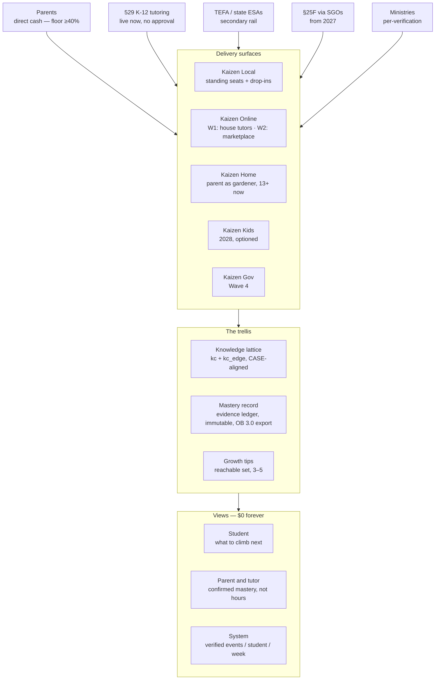

# Kaizen AI — strategy and architecture

**Status:** v0.2 — supersedes v0.1 (2026-09-01)
**Last updated:** 2026-09-02
**Owner:** Manny
**Purpose:** canonical reference for the business model, product architecture and
shipping sequence. Anything that contradicts this doc is out of date — update
here first, then propagate. `web/lib/server/clubPricing.js` is the only price
truth; the seat is there as `SEAT_PLAN` ($550) since 2026-09-02.

**How to read the marks.** Every load-bearing figure carries one:
✓ read in a primary source, or agreed by two or more independent sources ·
~ one secondary only, or a search excerpt of the primary · ✗ v0.1 stated it and it
is wrong; the corrected figure follows · ? could not be verified this session.
This revision was researched from an environment whose egress proxy blocked every
`.gov`, statute, news and vendor host; Texas-specific statutory figures were
corroborated by multiple independent secondaries but **not read in the statute**,
and are marked ~ accordingly. Re-read `comptroller.texas.gov/programs/education/esa/`,
`educationfreedom.texas.gov`, SB 2 (89R) §§29.351–29.365 and 34 TAC ch. 16 before
any external use.

---

## 0. What changed from v0.1

| v0.1 said | v0.2 says | Why it matters |
|---|---|---|
| §25F is parent-directed public money that turns on 2027-01-01 | ✗ §25F is a **donor** tax credit — $1,700/taxpayer/yr, nonrefundable — routed through state-listed scholarship-granting organisations. No provider list, no marketplace, private money. Tutoring is a qualified expense. | It is a BD motion with 2–5 Texas SGOs in 2027, not a rail to get approved on. |
| TEFA: ~$10,474/student; approved-provider status is "the gate on which everything downstream depends" and "a defensible moat" | ✗ $10,474 is the accredited-private-school tier; homeschool/other is **$2,000**; disability up to $30,000. **Public-school students cannot hold a TEFA.** Vendor applications are rolling, non-exclusive, ~4–6 weeks; ~2,400 vendors were listed at launch (~). | TEFA is a secondary rail. The addressable Austin pool is a few hundred homeschool teens at $2k plus private-school residual and the disability tier. |
| (omitted) | **529 K-12 tutoring is live now** — qualified for distributions after 2025-07-04, $20,000/yr K-12 cap from 2026, no application, no state approval ✓ | The larger rail, and the one that reaches Kaizen's 13+ public-school families today. |
| (omitted) | **Every public rail except Arizona requires credentialed tutors** (teaching licence / postsecondary teaching / accredited-school staff, plus fingerprinting on TEFA) ~ | The "interviewed and approved, $22–30/hr" tutor pool cannot bill any rail. A certified-tutor tier is a labour-model change, not a listing. |
| "No accountability layer" | ✗ TEFA already requires an annual nationally norm-referenced test for private-school participants in grades 3–12 (~). What does not exist anywhere is **provider-level or skill-level** verification. | Restate the thesis at the level where it is true; ingest MAP/norm-referenced scores as the external anchor. |
| Tutoring effect ~0.37 SD; ~0.25 SD at scale; <2% get high-quality tutoring | ✗ Peer-reviewed pooled estimate is **~0.29 SD** (Nickow et al., AERJ 2024); at scale **0.14–0.22 SD** (Kraft, Schueler & Falken, RER 2026); the <2% figure has no source. | Plan on 0.15–0.20 SD on an external test; delete <2%. |
| "Nobody publishes dollars per SD — invent the metric" | ✗ Published since 2013 (J-PAL SD-per-$100; Kraft 2020 effect×cost matrix; Accelerate 2024–25 cost tools and outcomes-based-contracting model policy). | Adopt Accelerate's method verbatim; publish it *on a running cadence with a counterfactual*, which nobody on the ESA side does. |
| Edtech VC ~$1B H1 2026 (−26%); median AI-ed round $7.9M; no $50M+ rounds in 12 months | ~ $1B / −26% (HolonIQ, via secondary); ✗ $7.9M unverifiable — deleted; ✗ Preply $150M at $1.2B (2026-01-21), Multiverse $70M at $2.1B (2026-05-15), AMBOSS $260M (2025-03). | The scarce-capital premise survives; the specifics did not. |
| Kaizen Local $450–650/mo standing seat, 45–55% GM | Kept as the price band; **the seat is now defined** (§5.1). Labour-only GM is 76–85%; the doc's 45–55% is a fully-loaded figure that needs ~31–41 seats with rent. The cash-cow gate passes at **~12 seats in borrowed space**. | Define before pricing; gate the lease on committed seats. |
| Kaizen Certified: "UL or Michelin, not McDonald's", $1–2K/mo + rev share | ✗ As written it is a **franchise** under 16 CFR 436.1(h) ✓ (mark + control/assistance + payment ≥$735 in six months). | Restructure or accept an FDD (§5.4). |
| Kaizen Gov $0.50–2.00/student/yr | ~ Below Google Workspace for Education Standard ($3/student/yr ✓); billable unit undefined. | Price the verification event, not the seat. |
| Kaizen Kids 2027, $29–39/mo, 85%+ GM, the VC story | Moved to **2028, optioned**; price band restated (§5.3); out of the seed narrative. | The COPPA build has not started; model-provider under-13 terms and CA SB 1119 audit costs are real. |
| Kaizen Online: 20–25% take-rate marketplace live by Dec 2026 | Wave 2. Wave 1 "Online" = remote sessions by house-paid tutors on the built video path. | Stripe Connect is dark, counsel items 1–9 are open, and take-rate is a different labour relationship from flat pay. |
| "Kaizen AI: the company. Legal entity, brand, everything." | Kaizen AI is the **company and brand**; the registered entity is **Kaizen Academy LLC** (CI-enforced) until counsel restructures. | Never print "Kaizen AI LLC". |
| CA SB 243 / NY Art. 47 / GUARD Act make "a large share of competitors legally non-viable by 2028" | ✗ Overreach. The enacted duties cost days of engineering; the GUARD ban is not law. **The shipped 13+ tutor may already owe SB 243 duties** (persona, AI disclosed only "if asked"). | Fix the 13+ product now; claim only what statutes support. |

---

## 1. Thesis

Kaizen AI sells learning and owns the record of learning.

Two facts drive the strategy, restated at the strength the evidence supports:

1. **Edtech venture capital is scarce.** Global edtech VC was ~$1B in H1 2026,
   down ~26% year over year (~ HolonIQ H1 2026 note, via secondary; primary not
   read). Large rounds still close for profitable, growing companies — Preply's
   $150M Series D at $1.2B (✓ 2026-01-21) and Multiverse's $70M at $2.1B (✓
   2026-05-15) — which is the point: a tutoring company raises on growth and
   gross margin, not on category. A seed in 2027 is priced against a median US
   seed of ~$3M (IQR $1–5.6M) and a Series A bar of $2–4M ARR, with only 16% of
   the 2024 seed cohort having graduated to an A (~ Crunchbase News, 2026-05-26).

2. **Parent-directed money is real, and the verification gap is real at one
   specific level.** Texas TEFA appropriated $1B for 2026–27 only (expires
   2027-08-31; 2027–28 depends on the 90th Legislature, Jan 12–May 31, 2027)
   (~ corroborated by three independent sources). It drew 274,183 applications
   against a ~90,000-student cap (~); tutoring and online programs are approved
   categories (~). Federal 529 plans now pay for K-12 tutoring with no approval
   at all (✓ IRC §529(c)(7)(E), OBBBA). The federal §25F credit adds donor money
   through SGOs from tax year 2027 (✓ statute read). States already test ESA
   students annually (~ TX, FL, AL, AR, TN). **What no state, platform or provider
   does is verify learning at the provider or skill level, continuously, between
   annual tests.** That — not "no accountability" — is the ownable position.

The tutoring is how we get in; the trellis is what we own. Unchanged.

---

## 2. Naming and hierarchy

Same vocabulary as v0.1, with one row corrected. Do not deviate.

| Term | Means | Does NOT mean |
|---|---|---|
| **Kaizen AI** | The company and the brand. | Not the registered legal entity. That is **Kaizen Academy LLC** (founder-confirmed 2026-07-28; `web/test/claims.test.mjs` fails the build on any other entity string). Restructuring is decision §10.3. |
| **The trellis** | The product. The academic structure a student grows on. In code today: the evidence engine (`web/lib/engine/`, `docs/ENGINE.md`). | Not a company. Not a "learning path." Not a dashboard. |
| **Knowledge lattice** | The prerequisite graph. In code: `kc` + `kc_edge(kind ∈ {prerequisite, confusable})` (migration 0012). | Not the student's progress. |
| **Mastery record** | Per-student, verified, append-only history of demonstrated mastery. In code: the `evidence` ledger + `kc_estimate` (0013/0015/0030/0032). | Not a grade. Not session hours. |
| **Growth tip** | The 3–5 nodes a student can reach *right now*. In code: the reachable set `policy.js` already computes and then collapses to one. | Not "next lesson." |
| **Surface** | A place where a student grows along the trellis (Local, Online, Home, Kids, Gov). | Not a separate business. |
| **View** | A read-only rendering of the trellis for an audience. | Not the trellis itself. |

Delivery surfaces: **Kaizen Local**, **Kaizen Online**, **Kaizen Home**, **Kaizen Kids**, **Kaizen Gov**.

**Kaizen Home** (added 2026-09-02): a parent uses the trellis to homeschool. Same
product, different gardener — see §4.6.

---

## 3. Architecture

**Read it as:** money enters through five rails (four of them public or
tax-advantaged, one of which needs no approval at all), is spent on five surfaces,
every surface writes to one trellis, and the trellis is read through three views.
The views are free forever — a ledger only becomes a standard if it is universal.
We monetise the verification, never the record.

---

## 4. The trellis — product principles

### 4.1 It is a lattice, not a path
Unchanged, and already true in the schema: `kc_edge` carries prerequisite *and*
confusability edges (0012:59–63), and `policy.js` refuses to teach a node whose
prerequisites are unconfirmed. What is missing is not code but edges: **8 verified
middle-school-math concepts, 32 items, 5 prerequisite edges, 3 confusable edges
are live**; 15 Algebra I concepts / 90 items exist in `seed_kc_algebra1.sql`
entirely in `draft` and cannot be served. "Every skill, K-12" is content
operations — sign-off, not authoring code.

### 4.2 Growth happens at the tip
Unchanged. `policy.js` computes the reachable set (lines 61–66) and collapses it
to one KC (76–77). Exposing the set as `growthTip` (3–5, shallowest first) and
accepting a learner's `focusKcId` is days of work, and it is the entire
pedagogical differentiator made visible.

### 4.3 The gardener is human
Unchanged. The human tutor already writes confirming-class evidence
(`tutor_observation`, `assisted=false`, `verified_by=human_tutor`) on the 1:1 and
group-brief paths. **The Homework Hall — the standing seat's delivery room —
writes nothing.** Per-KC exit ratings routed through `appendEvidence` are the
single cheapest, highest-value Wave 1 engineering item.

### 4.4 Non-negotiable architectural constraint — restated precisely
"Externally writable from day one" is reinterpreted, because the repo today has
no standards mapping, no external write path, and an account export that omits
all eleven engine tables (`api/account/export` grabs the legacy `mastery_events`
/ `student_concept_mastery`, never `evidence` or `kc_estimate`). The verified
record is **not portable today**, and append-only is a code convention, not a
database constraint (no trigger on `evidence`).

From day one means, concretely, in Wave 1:
- **Standards-tagged:** a `kc_standard` crosswalk (kc_id, framework ∈ {TEKS,
  CCSS}, CASE identifier). TEA publishes TEKS in 1EdTech CASE format with CSV
  and an API at `teks.texasgateway.org` (✓ mandated on publishers since
  Proclamation 2020); 1EdTech runs a free 50-state CASE registry (✓); the
  Common Standards Project exposes GUIDs for every state (✓). Tag the 23 math
  KCs. This is the answer to open decision §10.1: schema first, and the schema
  already exists.
- **Immutable:** migration 0033 adds a `BEFORE UPDATE OR DELETE` trigger on
  `evidence` that raises; corrections are new rows referencing the row they
  adjust.
- **Portable:** the export gains a versioned `kaizen-mastery-record/v1` section
  (evidence, confirmed `kc_estimate`, standards codes). Its target shape is
  fixed by standards that already exist: each confirmed-mastery event is an
  **Open Badges 3.0 `AchievementCredential`** (✓ Final Release since v1.2,
  2024-12-23) on the **W3C Verifiable Credentials Data Model 2.0** (✓
  Recommendation 2025-05-15), with `achievement.alignment` → the CASE URI, and
  the evidence stream exposed as **xAPI 2.0** statements (✓ IEEE 9274.1.1) with
  `assisted`, `verified_by` and `delay` as extensions.

The **partner write API** — keyed clients, `POST /api/v1/evidence` through
`appendEvidence`, non-confirming until the partner is certified — is Wave 2,
when a partner exists. Retire the 0015 migration header's "deliberately no
roster, district or curriculum-code reporting" as design intent; it now
contradicts this section.

### 4.5 Anti-gaming
Unchanged and already the strongest asset in the repo relative to this doc:
Working vs Confirmed tiers; confirmed requires unassisted, verified (symbolic /
structural / human), delayed, k-of-n across ≥2 contexts, model-graded evidence
never confirming (`types.js`, `docs/ENGINE.md`). One defect a ministry would
find in an hour: **`docs/ENGINE.md` says the delay is ≥24h, `config.js` sets
48h, and the observe route hard-codes a 36h post-session floor.** Reconcile to
48h in the doc (done in this revision) and cite the 36h post-session floor as a
separate, named rule. Update the Bastani citation to its published form (PNAS
2025) and add Shen & Tamkin 2026 (~ arXiv 2601.20245) as the replication.

### 4.6 The parent can be the gardener (new, 2026-09-02)

A trellis does not care who ties the vine in. **A parent homeschooling a child
uses the same lattice, the same growth tips and the same mastery record** — the
lattice as the curriculum map (what is in reach, what it depends on), the growth
tip as today's lesson, the diagnostic as placement, the standards crosswalk as
the record a state or a college asks for, and Halls, Clinics and seats as
optional human time. Kaizen Home is not a separate product; it is the trellis
with the parent in the gardener's role.

Two design consequences, and they are the whole point:

1. **A parent's observation is not verification.** The mastery law (§4.5) admits
   `verified_by ∈ {symbolic, structural, human_tutor}`; a parent is none of
   those, and adding them would turn the record into exactly the asserted,
   farmable transcript §4.5 calls worthless. So a homeschooled student's
   *confirmed* mastery comes from the same place everyone's does — unassisted,
   delayed checks the engine grades, and credentialed tutors who observe. That
   is what makes a Kaizen homeschool transcript worth more than a parent-kept
   one, and it is the honest version of "we can prove your kid learned it."
   The parent sees everything, assigns anything, and certifies nothing.
2. **The record is the product.** For a Local family the report is a
   deliverable; for a Home family it is the school. Portable export (§4.4) —
   standards-tagged, immutable, OB 3.0-shaped — is not a Wave 2 nicety for this
   surface; it is the thing they are keeping.

Scope: **13+ today**, which is where transcripts matter most (high-school
homeschoolers heading for college, dual credit, or the workforce). Under-13 is
the Kids build (§5.3), not a flag flip. `docs/archive/MINIMAL_SAAS_PLAN.md` (2026-08-13)
already carried this thesis — ~750k microschool students, 38% on ESA funds,
record-keeping as microschools' weak spot — and it stands.

### 4.7 The external anchor (new)
Cost per SD needs a denominator nobody disputes. Alpha School's entire evidence
claim is MAP growth (~); TEFA requires a nationally norm-referenced test yearly
(~). **The trellis ingests MAP RIT (or Iowa / STAAR / CLT) as its external,
delayed, unassisted anchor** and calibrates KC-level mastery against it. Without
this, "verified" is self-referential.

---

## 5. Business units

| Unit | Who pays | Price | Gross margin | Real job | Wave |
|---|---|---|---|---|---|
| Kaizen Local — standing seat | Parents (cash, 529) + TEFA/ESA where eligible | $450–650/mo, **one price for every payer** | 76–85% labour-only; 45–55% fully loaded at 31–41 seats with rent | Cash now, evidence lab | 1 |
| Kaizen Local — drop-ins | Parents, TEFA $2k tier | $14 Hall / $30 Clinic / free Community Hall (built, CI-pinned) | $87–95 contribution per full tutor-hour | Funnel to the seat; the ≥40% direct-pay floor | 1 |
| Kaizen Diagnostic | Parents, ESA "assessment" | $59 one-time | ~90% | Placement onto the lattice; the seat's on-ramp; baseline evidence row | 1 |
| Kaizen Online — house tutors | Parents, 529 | Same price book, delivered remotely on the built video path | as Local | Texas reach without Connect | 1 |
| Kaizen Online — marketplace | Parents + ESA; take on tutors | 25–30% take (Wyzant 25% ✓, Outschool 30% ✓, Preply 18–33% ✓) | 70%+ on net take only | Geographic scale, tutor supply | 2 |
| Kaizen Home — homeschool | Parents; TEFA $2,000 homeschool tier (~); **not** 529 for at-home instruction (✓ §529(c)(7)(E) requires tutoring "outside of the home") | **No new SKU.** Free AI + Max AI $11.99 + $59 diagnostic + drop-ins; a seat is optional | as the components | The record's first true owner-customers; the $2,000 tier's natural fit; the microschool bridge to Certified | 1 (13+) |
| Kaizen Kids | Parents | see §5.3 | 70–80% | Optioned consumer line | 3 (2028) |
| Kaizen Certified | Independent centres | see §5.4 | 80%+ | Scale without leases — **if structured to not be a franchise** | 3 |
| Kaizen Gov | Ministries, states | per verification event, not per seat | 90%+ | Legitimacy, the fabric claim | 4 |

Views (student, parent/tutor, system dashboard): **$0, permanently.** The
numeric view is computed from `kc_estimate` with no LLM in the path; only an
optional narrative may be metered.

### 5.1 The standing seat, defined

v0.1 gave a price and a margin and no product. Both analysts modelled different
seats and got different answers; the seat is now fixed so the arithmetic is:

- **What it is:** a reserved, recurring, in-person place — **2 sessions/week ×
  75 minutes, ratio 1:4, single subject, named lead tutor** — plus the diagnostic
  at intake, AI practice between sessions at the highest free-tier limits, and
  a **monthly verified mastery report** as the deliverable. It is *tutoring*
  (see §7.3 on why that word matters now) and it is a distinct `kind` from the
  1:8 Homework Hall, which stays a supervised study hall.
- **What it costs to deliver:** 8.67 sessions/month. At the built $27.50/hr
  tutor pay: $74.50/seat-month. At a **certified-tutor rate of $40/hr** (see
  §7.3): $108/seat-month.
- **Labour-only gross margin at $550:** 83% (built pay) / 77% (certified).
- **Fully loaded**, borrowed space at $0 + $1,500 lead stipend + ~$600
  fixed/Stripe/insurance: contribution ~$454 (built) / ~$421 (certified) per
  seat-month; **breakeven ~5 seats; the cash-cow gate (≥$3,000 owner profit AND
  ≥25% margin) passes at ~12 seats — $3,351 profit, 51% margin.** At $30/hr room
  hire it passes at ~14 seats; with a $2,500 lease at ~17; with a $4,000 lease
  at ~20 (✓ recomputed, `scratchpad/seat_econ.py`).
- **The lease rule**, replacing the prior "$15k MRR": **no lease before 16
  committed seats.** The Mathnasium benchmark (~ AI-extracted FDD, FY2025,
  unsourced — order of magnitude only) is ~1,400 sq ft at ~$4,100/mo rent with a
  median centre at ~$27k/mo revenue; the bottom quartile averages ~$14.7k/mo,
  i.e. ~27 seats at $550. Plan to be a bottom-quartile centre in year one.
- **Pricing rule:** one price for cash, 529, TEFA and any future SGO family.
  Texas has published school-level guidance barring TEFA-triggered increases
  and requiring return of advance payments when a student leaves (~
  `educationfreedom.texas.gov`, tuition-and-fee guidelines); assume vendor
  offerings face the same review, and Odyssey flags offerings priced above
  market (~). A CLAIMS_MATRIX row states the parity policy. **No prepaid stored
  value** — which is also why the prior plan's $699 sprint is stripped (§11).

### 5.2 What TEFA can and cannot pay for

All ~ unless marked: award tiers **$10,474** accredited private school (typically
~$10,300 paid), **up to $30,000** with a qualifying disability, **$2,000**
homeschool/other non-public. Public-school students are ineligible. Year-one
funding ran out inside the low-income tiers; ~1 in 4 funded participants has a
documented disability; ~6,000 participants in Central Texas, ~1,000 inside
Austin ISD boundaries. Cash arrives in tranches — 2026-07-01 (25% private / 100%
homeschool), 2026-10-01 (25%), 2027-02-01 (50%) — Net-30 via ACH with a platform
history of slippage (Idaho dropped Odyssey for non-payment; Iowa's audit found
fee amendments). Comptroller turnover: Huffines sworn in 2026-08-01.

So: a $550 seat exhausts a homeschool award in 3.6 months; a private-school
family's award is mostly tuition; **the disability tier is the one TEFA segment
that can carry a seat**, and the mastery ledger is unusually well matched to
IEP-progress documentation. **The $2,000 homeschool tier is Kaizen Home's tier:**
free AI, Max AI at $11.99, the $59 diagnostic and the $14/$30 drop-ins all fit
inside it as-is, with no new SKU (§4.6). Whether homeschool-tier TEFA students
face the annual norm-referenced test is unread (?) — confirm before any copy
says either. Treat TEFA as partial subsidy and upside, never as the plan.

### 5.3 Kaizen Kids, restated

The 5–11 AI-tutor comp, Synthesis Tutor, lists ~$35–45/mo individual, ~$70/mo
family, ~$119/yr family on the App Store (~ mirrors of its pricing page); the
broad kids-ed band (ABCmouse, HOMER, Ello, Reading Eggs) is $8–15/mo (~). $29–39
is defensible only with Synthesis-grade authored content and a narrowly scoped
LLM — which is also what keeps the product outside the companion definitions.
Model gross margin at 70–80% (TTS/STT for non-readers is real inference cost).
Kids is **2028, optioned, out of the seed narrative**, for structural reasons:
the COPPA build has not started; OpenAI's API guidance requires zero data
retention before processing any under-13 personal data (✓ verbatim mirror,
2026-06-27); Anthropic permits minor-facing products only with age verification,
content moderation and AI disclosure (✓ Help Center 9307344, mirror); CA SB 1119
— annual child-safety risk assessments and independent audits by 2027-07-01 —
passed the Legislature 2026-08-31 and awaits the Governor (~).

### 5.4 Kaizen Certified is a franchise as written

16 CFR 436.1(h) (✓ read on two eCFR mirrors): a franchise exists when a business
(1) operates under the franchisor's mark, (2) the franchisor exerts or may exert
significant control over, or provides significant assistance in, the method of
operation, and (3) makes a required payment — with a $735-in-six-months
exemption floor. "Curriculum + trellis + ops" for "$1–2K/mo" under the Kaizen
mark meets all three in the first month. The escapes are structural:

- **(A) UL-true.** Sell a standards audit and the "Kaizen Verified" mark with **no
  operating system** — no ops manual, no marketing plan, no scheduling
  software. Price as an annual audit fee plus a per-verified-assessment fee.
- **(B) Prenda-shaped.** The network is the provider of record; centres are
  guides; Kaizen bills a per-student platform fee funded by ESA dollars (~
  Prenda ~$2,199/student/yr, unsourced). Kumon's per-student royalty ($38/
  student/subject/mo ~) is the franchise analogue of the same economics.
- **(C) Accept it.** An FDD, audited franchisor financials, state
  registrations. Kaizen Academy LLC would need audited statements first.

Franchisor take across kids-ed brands is 12–20% of centre revenue (~ Mathnasium
~18%, Code Ninjas ~14%+flat, Kumon ~17–25%). That is the ceiling any independent
centre will pay; "$1–2K/mo" is inside it only for a centre doing $6–15k/mo.

### 5.5 Kaizen Gov

Google Workspace for Education Standard is $3/student/yr, Plus $5 (✓ Google's
editions page, via scrape). NWEA MAP Growth is reported at $13.50–15.50/
student/yr (~ one derived secondary). Alpha sells Timeback to states at ~$2,000/
student/yr for intervention blocks (~ low confidence). $0.50–2.00/student/yr for
an undefined unit is below the cheapest K-12 utility SKU. **Bill the
verification event** — an issued, standards-aligned, externally-anchored
credential — and let the record and the views stay free. Do not model Gov
revenue before a first ministry conversation.

---

## 6. Shipping sequence

The founder is solo, employed, and rated by v0.1 itself as the highest risk in
the plan. Wave 1 is sized to **~195 founder-hours** (15 hrs/wk × 13 weeks to
2026-12-31) and to a director who delivers every session.

### Wave 1 — now → Dec 2026 · Cash, credentials, silent capture

Gates carried forward from `docs/RELEASE_PLAN.md`, unchanged: stage 0 (paste the
price envs, **re-close `club_enabled`** — it is open in production only as a
`GO_LIVE.sql` side effect — set `voice_enabled=false` and
`expensive_models_enabled=false`), stage 1 (10 paid $59 diagnostics before any
hiring), stage 2 (counsel packet, items 10–16, with item 12 **rewritten for the
seat** rather than the memberships).

In order, after those:

1. **Founder paperwork, week 1.** Answer review-queue items 1 (organising
   state), 9 (insurance), 15 (pay band). Confirm Kaizen Academy LLC is
   SOS-registered and in franchise-tax good standing (a TEFA vendor
   prerequisite ~). Open the Odyssey TEFA vendor application (rolling ~; the
   portal has accepted service vendors since March 2026 ~). Ask Odyssey vendor
   support two questions in writing: can a monthly seat be listed and
   auto-charged, and is an AI study companion "technology" (10% cap ~) or
   "online learning program" (uncapped ~).
2. **Define the seat on one page** (§5.1) and get it in front of counsel with
   item 12. Publish the parity policy. Same price for every payer.
3. **Hire the Club Director** against `docs/hiring/*` re-parameterised to
   seats — escalators at 12 seats by December and 20 by March; the interview
   question becomes "sell me a $550 standing seat honestly." Director delivers
   every session; founder teaches zero.
4. **Recruit two credentialed tutors** — retired Texas teachers are explicitly
   eligible on TEFA (~) and satisfy 529's "teaching licence in any state" prong
   (✓). Fingerprint them (~ IdentoGO, weeks to months). This, not a deadline,
   is the real TEFA gate: **the listing goes live when two tutors satisfy
   §29.358(b)(2) and are fingerprinted.** Aim for the 2027-02-01 50% tranche.
5. **Sell twelve seats in borrowed space.** Convert the diagnostic buyers
   first. Gate: 12 seats held one full month → the cash-cow conditions pass
   asset-light. Lease decision at 16 committed seats, not before.
5b. **Homeschool families are a named Wave 1 segment** (§4.6): 13+
   homeschoolers and the Central Texas co-ops and microschools (Austin 16,
   Cedar Park 5 ~). Two of the stage-1 school conversations are with co-ops.
   They buy what exists — the diagnostic, the AI, drop-ins — and they are the
   first users of the parent view below. No homeschool-specific SKU until one
   has been asked for.
6. **Silent capture, in hours not weeks:** `kc_standard` crosswalk + TEKS/CCSS
   codes on the 23 math KCs; migration 0033 immutability trigger; the
   `kaizen-mastery-record/v1` export; per-KC Homework Hall exit ratings through
   `appendEvidence`; `check_floor_at` on the group path; `growthTip` from
   `/api/engine/state`; `familySummary` rebuilt on `kc_estimate` with attendance
   demoted; an admin panel computing **verified mastery events per student per
   week** directly from `evidence`. Sign off the Algebra I bank. Seed released
   NAEP/TIMSS anchors for the live KCs. **For Home:** the parent view gains the
   lattice itself (confirmed / working / reachable per KC), the ability to set
   `focusKcId` for the student, and the export as a transcript — the same three
   items, read from the parent's side.
7. **The 13+ compliance subset, now** (§7.3): unprompted AI disclosure at
   session start, a 3-hour break reminder, a hard rule against unprompted
   emotional check-ins, transcripts visible to the parent. Days of work; it is
   sold in California and New York today.
8. **Seat SKU in code — done 2026-09-02 by founder decision** (ahead of the
   first sale, so everything builds against one definition): `SEAT_PLAN` and
   `SALE_STATUS` in `clubPricing.js`, migration 0033, `/terms`, `/pricing`,
   `/billing`, pinned tests, CLAIMS_MATRIX rows. Club/Plus/Max retired from
   sale. Remaining: the seat's live Stripe Price (`STRIPE_PRICE_SEAT`) and
   counsel's seat terms (review-queue item 17).

**Wave 1 exit gate:** the four cash-cow conditions (covers own costs incl.
part-time help; owner ≥$3,000/mo; ≥25% net margin; founder ≤15 hrs/wk) held for
one month **and** every in-person session writing standards-tagged, exportable,
immutable evidence. TEFA listing is a capability gate (two credentialed,
fingerprinted tutors), not the wave's gate.

### Wave 2 — 2027 · Product and the raise

- 529 invoices compliant from day one (tutor credential on the invoice ✓
  §529(c)(7)(E)); §25F BD with the Texas SGOs the day the 2027-01-01 list
  publishes (✓ statute: participation is fixed by each state's SGO list filing).
- Partner write API (§4.4). OB 3.0 / xAPI export live. Trellis views public with
  12 months of longitudinal data.
- Kaizen Online as a take-rate marketplace: Stripe Connect (HANDOFF P1 steps
  2–8), counsel items 1–9, take set at 25–30%, **two tutor pools, never one
  person in both** (Local: flat-pay; Online: Connect sellers).
- **First cost-per-SD figure computed with Accelerate's cost method against MAP
  growth with a matched comparison group, reviewed by an external
  methodologist.** A self-published cost/SD with no counterfactual is worse than
  none.
- Entity/IP structure with startup counsel ahead of the seed (§10.3).
- **Gate:** do not raise before a year of real students in the record.

### Wave 3 — 2028 · Certification network and Kids (optioned)

- Certified under structure (A) or (B) from §5.4; first centres are the Central
  Texas microschools — Austin 16, Cedar Park 5, Dripping Springs 3, Round Rock
  2, Georgetown 2 (~ microschool.directory, 2026) — densest market in the state.
- Kids only after the dedicated COPPA build (§5.3), Synthesis-style
  architecture, Anthropic-only text path, no voice for under-13.
- **Gate:** first 10 non-Kaizen centres writing to the trellis.

### Wave 4 — 2029–30 · The fabric

Unchanged in intent; the learning passport is **not built by Kaizen** — it is an
OB 3.0 / CLR 2.0 bundle that drops into whichever wallet a state procures
(Wyoming has already tendered an LER wallet ~). Kaizen Gov sells issuer trust and
verification events. Model-agnostic deployment so no government must bet on a
single US lab.

---

## 7. Moats

### 7.1 Evidence, positioned correctly
Pooled tutoring effect **~0.29 SD** (✓ Nickow, Oreopoulos & Quan, *AERJ* 61(1),
2024 — the 0.37 in v0.1 is the 2020 working paper); stronger for teacher and
paraprofessional programs than nonprofessional and parent (✓ direction; point
estimates not re-read); **0.14–0.22 SD at scale** (~ Kraft, Schueler & Falken,
*RER* 2026); the strongest recent trials are Chicago Saga (+0.18 to +0.40 SD, ✓
Guryan et al., *AER* 2023) and Saga Tech (0.23 SD at one-third lower cost ~).
Our claim is unchanged: *AI runs the practice, humans certify the mastery, the
trellis proves it.* Alpha's claims rest on internal analyses (✓); campus count
13–17 (sources conflict); its after-school "Alpha Hours" at $4,500 per seven-week
session is a candidate's proposal dated 2026-08-27, not a company plan (✓ read)
— treat Austin after-school competition from Alpha as unconfirmed.

### 7.2 Child safety as architecture — at statute strength
- **CA SB 243** (✓ chaptered text, Ch. 677, effective 2026-01-01): the
  exclusions are exhaustive and none covers education; for a *known* minor the
  operator owes disclosure, a 3-hour break reminder, and crisis protocols;
  $1,000/violation private right of action.
- **NY GBL Art. 47** (✓ structure via enacted RI/WA mirrors; effective
  2025-11-05 ~): "AI companion" requires all three of retaining prior-session
  information to personalise **and** asking unprompted emotion-based questions
  **and** sustaining dialogue on matters personal; disclosure at start and every
  three hours.
- **GUARD Act S.3062** (✓ 22-0 Senate Judiciary 2026-04-30; H.R. 8623 companion;
  no floor vote through 2026-08-31).
- **COPPA amended rule** (✓ 90 FR 16918; effective 2025-06-23; compliance
  2026-04-22): VPC methods enumerated — a Stripe charge is a "monetary
  transaction." Open classification: whether an API model provider is "support
  for internal operations" or a third party under §312.2.
- **Washington HB 2225** exempts narrowly tailored educational tools; California
  does not (✓). A 50-state exclusion map is the compliance artefact a ministry
  will ask for.

**Design list, replacing v0.1's five points:** parent-verified account via a
COPPA-listed VPC method; curriculum-scoped responses; transcripts visible to the
parent; no persona; unprompted non-human disclosure at session start; 3-hour
break reminder; no unprompted emotional check-ins; crisis referral; no
behavioural profiling of minors; no training on minors' data. Ship all ten and
publish the audit. Delete "competitors legally non-viable by 2028."

### 7.3 The shipped product's exposure (new)
`web/lib/prompts.js:71` gives the 13+ tutor a persona ("warmth and personality")
and discloses AI only "if asked"; the mastery record retains prior-session
information by design. Under SB 243 Kaizen *knows* a user is a minor whenever a
13–17 birth year is stated. Whether the duties are owed today is a counsel
question (add to the review queue); the four prompt edits that make it moot are
Wave 1 item 7.

One more word that now carries legal weight: **"tutoring."** Every rail pays for
*academic tutoring* (✓ §530(b)(3)(A); ✓ §529(c)(7)(E) "outside of the home,
including at a tutoring facility"), and Kaizen's own Terms define the Homework
Hall as "shared supervision, not tutoring" (review-queue item 13). Keep both
truths: the Hall is supervision; **the seat is tutoring**, delivered by a
credentialed tutor at 1:4. Never let the storefront blur them.

### 7.4 Credentialed supply (new — the real moat on the rails)
TEFA (~ Texas educator certificate, or current/retired staff of an accredited
school, or higher-ed teaching, plus fingerprinting), Florida (~ FL cert / subject
bachelor's / demonstrated mastery), Alabama (~), and 529 (✓ licence in any state
/ postsecondary teaching / subject-matter expert) all require credentialed
tutors. Arizona alone requires only a diploma (~). Whoever holds a bench of
fingerprinted, licensed, retired teachers in Central Texas holds the supply every
rail needs. That is buildable, local, and slow to copy — unlike a vendor listing.

### 7.5 Distribution via ESA rails — demoted
Approval is non-exclusive and ~2,400 vendors were listed at launch (~). What
compounds is operational familiarity, not status. Keep applying; stop calling it
a moat.

### 7.6 Sit above the labs
Unchanged. Additionally: **Mastery.org** — Legend.org acquired the Mastery
Transcript Consortium from ETS on 2026-07-23 with 750+ college acceptors (~) —
now owns the "competency record" brand. Kaizen does not compete with it; Kaizen
is the **verified issuer** that feeds Mastery.org, state LER wallets and NWEA's
anchor. The strongest threat to the trellis thesis is that norm-referenced tests
simply *become* the verification layer; the answer is §4.6 — anchor to them,
then be the thing that verifies between them.

---

## 8. VC narrative

**Frame:** infrastructure for parent-directed education spending. Comps to reach
for are Plaid and Stripe, not Chegg. Services-heavy edtech spans 0.8x revenue
(Nerdy, ✓ two independent comps, FY2025 $179M, −6%) to 8–15x (Preply,
profitable, growing ~) — the multiple is about performance, not entity
structure (§10.3).

**The metric: cost per SD gained — on a running cadence, with a counterfactual,
audited.** It is not new (✓ J-PAL 2013; Kraft 2020; Accelerate 2024–25, which now
has a model state policy for outcomes-based tutoring contracts ~). What is new
is a provider publishing it quarterly against MAP growth with a matched
comparison. Adopt Accelerate's cost method verbatim so the number is legible to
the people who already use it.

**Round shape:** $3–5M seed in 2027 sits at the top of the seed IQR (~
$1–5.6M); at a ~$20–24M post it implies a Series A bar of $2–4M ARR within ~2
years against a 16% graduation base rate (~). Raise on Local/Online revenue,
cohort retention and the first external-anchor result. Kids is not in the deck.

**Metrics that matter (in order):**
1. Verified mastery events per student per week (computed from `evidence` where
   `isConfirming` — Wave 1 item 6 makes this a live number)
2. Cost per SD gained, external anchor, matched comparison
3. Cohort retention at 6 and 12 months
4. Non-Kaizen writes to the trellis (Wave 2+)

**Metrics to avoid leading with:** GMV, session hours, registered users. The
parent summary currently leads with sessions attended (`parentSummary.js:79`);
Wave 1 item 6 demotes it.

---

## 9. Risks

| Risk | Severity | Mitigation |
|---|---|---|
| TEFA funding cliff 2027-08-31; 2027–28 unappropriated; Comptroller turnover | High | Direct-pay ≥40%; 529 as rail #1; model TEFA receipts on tranches with Net-30+ slippage; never a cash-flow plan that needs TEFA on time |
| Credentialed-tutor supply — the rails are closed to the current pool | **High** | Wave 1 item 4; retired Texas teachers; $40/hr tier modelled and still passing the gate |
| Price-parity and anti-inflation scrutiny in the 2027 re-appropriation fight | High | One price for every payer, published; no prepaid stored value |
| Foundation models commoditise the tutoring layer | High | Value is in the record and the verification; views free |
| Child-safety regulation reaches the shipped 13+ product today (SB 243) | High | Wave 1 item 7; counsel question added |
| Evidence doesn't replicate at scale (0.29 → 0.14–0.22) | Medium | Plan on 0.15–0.20; publish honestly against an external anchor |
| Mastery.org / MAP become the record and the verifier | Medium | Be the issuer that feeds both (§7.6, §4.6) |
| Certified is a franchise | Medium | Structure (A) or (B) before any centre pays |
| Odyssey platform reliability (Idaho, Iowa history) | Medium | Assume slippage; keep invoices itemised and clean |
| Homeschool record rules vary by state (Texas: none; NY/PA: quarterly reports and annual assessment — see `docs/archive/MINIMAL_SAAS_PLAN.md`) | Medium | The standards-tagged export *is* the compliance artefact; never claim it satisfies a state until counsel has read that state's rule |
| Founder capacity — solo, employed, multiple ventures | **High** | Wave 1 sized to ~195 hours; director delivers; nothing in Wave 1 requires the marketplace, Kids, Certified or Gov |

---

## 10. Decisions

1. **Lattice scope.** *Resolved: schema first — and the schema already exists.*
   Add the CASE crosswalk, tag the 23 math KCs, sign off Algebra I. K-5 math is
   the Kids pour, Wave 3.
2. **Cash cow vs venture.** *Resolved as v0.1 proposed, and more credible under
   seats than under memberships:* Wave 1 is the cash cow, orchestrator-only,
   passing at ~12 asset-light seats rather than ~46 club families. Wave 2 is
   the venture. No employment decision is forced before a Series A requires it.
3. **Entity structure.** *Narrowed, not legal advice:* keep Kaizen Academy LLC
   as the operating and TEFA entity; "Kaizen AI" is the brand; report Local/
   Online as a services segment and the trellis as a software segment
   (`docs/archive/RAISE_NOTES.md` already does); decide an IP holdco with startup
   counsel ahead of the 2027 seed. The comps say the multiple follows
   performance, so this is not urgent.
4. **Brand exposure.** *Unchanged, unresolved:* confirm the Kaizen mark position
   before spending on it. Add: never print "Kaizen AI LLC."
5. **New — `club_enabled`.** *Decide in writing:* re-close it until counsel
   clears items 10–16 plus the seat terms (the rule-compliant path), or record
   an explicit founder risk acceptance. It must not stay silently on.

---

## 11. What this revision strips

From the repo and the prior plan, with the reason. Code is retired from sale,
not deleted, wherever zero customers exist to migrate.

| Strip | Reason |
|---|---|
| Club $45 / Plus $79 / Max $109 as sold products | 6–8x below the seat; the $45 tier is margin-negative at 2 students and cannibalises the seat. RETIRED rows; entitlement code stays as the metering rail the seat reuses. |
| AI + Hall $24.99 from launch | Bundles a Hall visit into an AI SKU. Built and disclosed; `STRIPE_PRICE_AI_HALL` stays unset. **The AI upgrade (`ai_solo`, "Max AI") stays** — the founder's standing decision (2026-09-01): free AI plus one optional upgrade, led on "track your whole schedule, not two classes." |
| The $699 sprint SKU | A discounted, self-terminating seat that churns the longitudinal record the raise depends on, and prepaid stored value the parity rules punish. Keep the Payment-Link-plus-roster *mechanic* for selling the first seats. |
| "Pricing is final, do not reopen" (`RELEASE_PLAN.md` §1.1) | Superseded by this doc. |
| "No lease before $15k MRR" | Derived at $75 ARPU. Now: 16 committed seats. |
| Kaizen Online take-rate marketplace from Wave 1 | Connect dark, counsel items 1–9 open, different labour model. Wave 2. |
| Kaizen Kids from Wave 2 and from the seed deck | Structural gates (§5.3). Wave 3, optioned. |
| "Kaizen AI = legal entity" | Kaizen Academy LLC, CI-enforced. |
| The legacy `conceptMastery` export as the mastery record | It exports client-writable tables and omits the ledger. Replaced by `kaizen-mastery-record/v1`. |
| Attendance-first parent summary; client-snapshot weekly report as a mastery narrative | "Hours" is the metric this doc says never to lead with; both launder unverified numbers. |
| "Live voice tutoring" landing claim while `voice_enabled=false` | Claims discipline. |
| The 0015 header's "deliberately no roster/district/curriculum-code reporting" as intent | Contradicts §4.4. |
| Every figure in the v0.1 §0 table marked ✗ | See §0. |

---

## 12. Sources

Read this session (2026-09-02). Hosts marked *(mirror)* were read as GitHub-hosted
copies because the original host was egress-blocked; re-read the original before
external use.

**Statutes and rules**
- 26 U.S.C. §25F, §529, §530 — OLRC USLM release *(mirror: TheJoshuaEvans/united-states-code, synced 2026-07-18)*
- 16 CFR 436.1, 436.8 — eCFR *(mirrors: AlextheYounga/ecfr; lucas-amberg/ecfr-analyzer, 2025-02-06)*
- 16 CFR Part 312 as amended 90 FR 16918 *(mirror, eCFR-derived)*
- California SB 243, Ch. 677 (2025) chaptered text *(mirror)*; SB 1119 status via theprojection-corpus digest 2026-08-31
- New York GBL Art. 47 structure via enacted Rhode Island S 2195 and Washington HB 2225 texts *(mirrors)*
- GUARD Act S.3062 / H.R. 8623 — rollcall.com, k12dive.com (excerpts); pbenn28/chasing-sunsets tracker (2026-08-01)
- Texas SB 2 (89R) status/votes — LegiScan-seeded dataset; **text not read**
- Texas TEFA program pages — comptroller.texas.gov/programs/education/esa/, educationfreedom.texas.gov, support.withodyssey.com (search excerpts only)

**Evidence and standards**
- Nickow, Oreopoulos & Quan — NBER WP 27476 abstract *(mirror)*; AERJ 61(1) 2024 pooled estimate via five independent citations
- Kraft, Schueler & Falken — EdWorkingPaper 24-1031 / RER 2026 via two independent summaries
- Guryan et al., AER 113(3) 2023; UChicago Education Lab 2024-03-27 release
- Dhaliwal, Duflo, Glennerster & Tulloch (J-PAL 2013); Kraft (2020, *Educational Researcher*); Accelerate 2024–25 cost and policy documents (excerpts)
- 1EdTech Open Badges 3.0 spec repo (main: v1.2 Final Release 2024-12-23; develop: v1.4.5) *(mirror)*; w3c/vc-data-model (Rec 2025-05-15) *(mirror)*; adlnet/xAPI-Spec; IMSGlobal/caliper-spec; commonstandardsproject/api
- TEKS CASE — teks.texasgateway.org; TEA machine-readable TEKS help desk; 1EdTech 50-state CASE registry announcement (excerpts)
- Legend.org / Mastery Transcript Consortium — ets.org newsroom, globenewswire 2026-07-23 (excerpts)
- Alpha School — Wikipedia (excerpt); srbdp/alpha-school-docs; nancytorvund-jpg/alpha-hour proposal 2026-08-27 *(read in full)*

**Regulation and providers**
- Anthropic "Guidelines for Organizations Serving Minors," Help Center 9307344 *(verbatim mirror)*
- OpenAI Under-18 API guidance *(verbatim mirror captured 2026-06-27)*
- Google Gemini under-13 policy (excerpt via mirrored dataset)
- Kids-market pricing — kmazanec/superbuilders-synthesis; JDerekLomas/funbookies; retentioncheck.com (excerpt)

**Unit economics and capital**
- Mathnasium / Kumon / Code Ninjas 2026 FDD extractions *(jmwproductconsultingllc/engine-foundersplinko, AI-generated 2026-07-09, unsourced — order of magnitude only)*
- Preply, Multiverse, Outschool, Nerdy — vibewatch/startup diligence files (2026-05/06); Kanakgupta/Screener_cloud NRDY (2026-09-01, market cap figure internally inconsistent)
- Take rates — Outschool, Wyzant, Preply help pages (excerpts)
- Seed/Series A — Crunchbase News 2026-05-26, Carta Q1 2026 via Sarah-Zou/economist wiki
- HolonIQ H1 2026 note — via research radar 2026-08-14 (primary blocked)
- Google Workspace for Education editions page (scrape)
- Central Texas microschools — boneshq/microschool-directory (2026)
- Seat economics recomputation — `scratchpad/seat_econ.py` (this session)

**Repository (read at HEAD, 2026-09-02)**
`web/lib/server/clubPricing.js` · `docs/RELEASE_PLAN.md` · `docs/legal/REVIEW_QUEUE.md` · `docs/CLAIMS_MATRIX.md` · `docs/ENGINE.md` · `docs/FINANCIAL_SCENARIOS.md` · `docs/archive/RAISE_NOTES.md` · `docs/archive/HANDOFF.md` · `docs/archive/MINIMAL_SAAS_PLAN.md` · `docs/compliance/RETENTION.md` · `docs/hiring/*` · `web/lib/prompts.js` · `web/lib/engine/{policy,session,ledger,types,config,calibration,check}.js` · `web/lib/server/{context,series,sessionStates,familySummary,parentSummary,tutorSafety,kcMap}.js` · `web/app/api/tutoring/{observe,hall,recap}/route.js` · `web/app/api/tutoring/group/brief/route.js` · `web/app/api/account/{export,delete}/route.js` · `web/app/api/reports/weekly/route.js` · `web/app/api/billing/checkout/route.js` · `web/app/api/safety/under13/route.js` · `web/test/{claims,clubPricing,priceTruth}.test.mjs` · `supabase/migrations/{0001,0004,0012,0013,0015,0017,0023,0024,0025,0026,0027,0029,0030,0032}_*.sql` · `supabase/{GO_LIVE,seed,seed_kc,seed_kc_algebra1}.sql`
