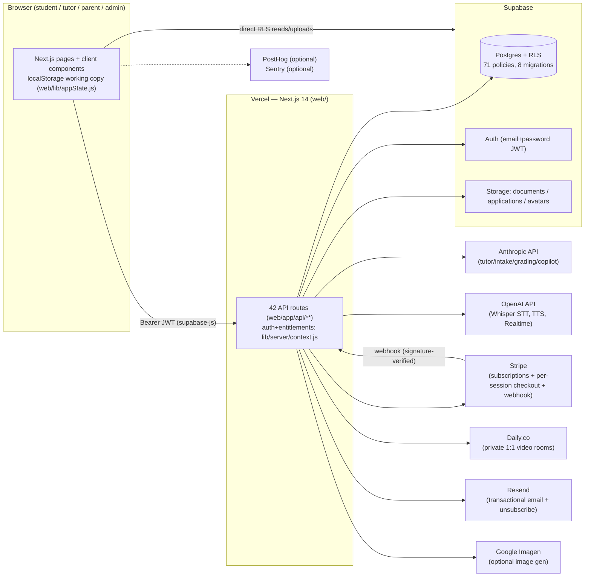

# Kaizen — Technical Source of Truth

> ⚠ **This document is frozen.** Later corrections live in [`ERRATA.md`](ERRATA.md), which supersedes this file where they disagree (entity name, background-check claim, migration count).

> **Product:** Kaizen — an AI tutoring platform (AI study companion + vetted human-tutor
> marketplace) for students 13+, sold to US consumers as subscriptions plus pay-per-session tutoring.
> **Target platform:** Web (Next.js 14 on Vercel serverless + Supabase). A dormant Expo mobile
> client and FastAPI backend exist in-repo but are not the shipping product (§2.3).
> **Audit basis:** read-only audit of branch `claude/demo-syllabus-exam-content-iufxth`
> (48 commits) on 2026-07-22. Every claim cites `path:line` or pasted command output.
> Companion: [`AUDIT_FINDINGS.md`](AUDIT_FINDINGS.md) (finding IDs referenced throughout).
> Items with legal implications are tagged `[ATTORNEY REVIEW]` — facts only, no legal conclusions.

---

## 1. Executive Summary

Kaizen is a working, deployable web product with two revenue lines: **AI tutoring
subscriptions** ($25/mo single, $50/mo “Study Circle” shared by up to 4 students, 3-month free
trial — `web/app/pricing/page.js:7-21`, `web/app/api/billing/checkout/route.js:95-100`) and a
**pay-per-session human-tutor marketplace** ($20–50/hr, 11% platform fee, free first session —
`web/app/api/tutoring/sessions/route.js:145-152,252-254`). The AI side is complete and
distinctive: bulk syllabus ingestion, Socratic chat that renders math/graphs/diagrams,
spaced-repetition mastery, a gradebook with GPA simulation, and AI briefs/recaps that wrap the
human tutoring loop. The safety/compliance layer is unusually deep for the stage: guardian
consent for minors, background-check-gated tutor activation enforced in code, in-session abuse
reporting, data export/deletion, email opt-out (§7–§8, §11).

**Completeness:** the live `web/` app builds clean (`✓ Compiled successfully`, 55 routes) and
every advertised feature traces to code (§4). The repo also carries three **dormant** stacks
(FastAPI backend scaffold, superseded Next.js frontend, Expo client) that are not wired to the
product and should be archived (SHIP-002).

**Top 5 risks:**
1. **Known-vulnerable framework** — Next.js 14.2.15 carries a critical advisory chain; upgrade required (SEC-001, Blocker).
2. **No license/ownership declaration anywhere** — no LICENSE file, no `license` fields (LIC-001, Blocker `[ATTORNEY REVIEW]`).
3. **Zero automated tests / zero CI** across the repo (SHIP-001).
4. **Payment race**: a late Stripe payment can resurrect a cancelled, re-bookable session (REL-001).
5. **Operational gaps behind legal promises** — manual payouts w/o W-9/1099 tooling, no retention schedule for minors’ transcripts, lazy (traffic-dependent) reminder emails (SHIP-006, DATA-001, REL-005).

**Ship-readiness verdict:** *Conditionally ready.* The product is functionally sellable today
for its stated scope (US, 13+), but a skeptical reviewer will treat SEC-001 and LIC-001 as
gate items and SHIP-001 as the largest engineering-maturity gap. Fixing the two Blockers is
days, not months (§5).

## 2. Product & System Overview

### 2.1 What it does
A student pastes or drops a semester of material (“magic box”); Claude organizes it into
courses, topics, assignments, and grade weights (`web/app/api/intake/route.js`,
`web/app/api/intake/ingest/route.js`, merge engine `web/lib/intake.js`). The student studies
with a Socratic AI tutor that renders rich output (KaTeX math, safe function graphs, mermaid
diagrams, highlighted code — `web/components/MessageBody.js`) or talks to it by voice
(Whisper STT + OpenAI TTS — `web/app/api/voice/*`). Sessions are graded 0–5 and feed an SM-2
spaced-repetition scheduler (`web/lib/mastery.js`); grades roll into a weighted gradebook +
GPA and what-if simulator (`web/lib/grades.js`). When a human is needed, students book vetted
tutors from a public directory (`web/app/tutors/page.js`), pay per session via Stripe
Checkout, and meet in a private Daily.co video room (`web/lib/server/daily.js`); the AI writes
the tutor a pre-session brief from live mastery data and turns the tutor’s notes into a
parent-friendly recap (`web/app/api/tutoring/{brief,recap}/route.js`).

### 2.2 Architecture



Evidence: client Supabase use `web/lib/supabaseClient.js:8-27`; service-role isolation
`web/lib/server/context.js:12-15`; external endpoints — Anthropic SDK
(`web/app/api/chat/route.js:5,14`), OpenAI (`web/app/api/voice/route.js:32`,
`voice/transcribe/route.js:46`, `voice/realtime-token/route.js:24`), Stripe
(`web/lib/server/stripe.js`), Daily (`web/lib/server/daily.js`), Resend
(`web/lib/server/email.js:56`), Imagen (`web/app/api/image/route.js:34`), PostHog
(`web/lib/analytics.js:32`), Sentry-compatible reporter (`web/lib/monitoring.js:1-7`).

### 2.3 End-to-end data flow & the dormant stacks
State is **client-first**: the browser keeps a localStorage working copy and mirrors it to
Postgres via debounced pushes (`web/app/dashboard/page.js:125-127`, `web/lib/cloud.js`);
server routes are the authority for money, safety, and entitlements. Files upload directly to
Storage under `userId/` prefixes; the ingest route app-level-verifies the prefix because the
service role bypasses RLS (`web/app/api/intake/ingest/route.js:60-63`).

**Dormant (not wired to the product):** `backend/` FastAPI+LangGraph scaffold (2,292 py LOC) —
real logic, in-memory stores, no callers in `web/` (verified: zero `web/` references to port
8000/its routes); `frontend/` (1,820 LOC) — “superseded by web/” (`README.md:12`); `client/`
Expo app (2,439 LOC) — targets the scaffold backend (`client/lib/api.ts:9`); `n8n/` — 5
workflow exports, 4 of which call endpoints that don’t exist (SHIP-005). Treat all four as
archive candidates (SHIP-002).

## 3. Technology Stack

| Layer | Technology | Version | Evidence |
|---|---|---|---|
| Web framework | Next.js (App Router, JS not TS) | 14.2.15 (exact) | `web/package.json`; build output |
| UI | React / react-dom | ^18.3.1 | `web/package.json` |
| Styling | Tailwind CSS | ^3.4.14 (3.4.19 installed) | `web/package.json`; license scan |
| Fonts | Fraunces, Plus Jakarta Sans via next/font (self-hosted at build) | n/a | `web/app/layout.js:2` |
| DB/Auth/Storage | Supabase (`@supabase/supabase-js`) | 2.110.0 | license scan output |
| AI (text) | Anthropic SDK; models fast/tutor/deep = `claude-haiku-4-5-20251001` / `claude-sonnet-5` / `claude-opus-4-8` (env-overridable) | SDK 0.32.1 | `web/lib/server/models.js:2-5` |
| AI (voice) | OpenAI Whisper/TTS/Realtime via REST | models env-overridable | `web/.env.example:29-31` |
| Payments | Stripe SDK | 22.3.0 | license scan |
| Video | `@daily-co/daily-js` | 0.90.0 | license scan |
| Rich chat | react-markdown 9.1.0, remark-gfm 4.0.1, remark-math 6.0.0, rehype-katex 7.0.1, katex 0.16.47, mermaid 11.16.0, react-syntax-highlighter 15.6.6 | — | license scan |
| Email | Resend REST API | n/a (no SDK) | `web/lib/server/email.js:56` |
| Hosting | Vercel (`framework: nextjs`) | — | `web/vercel.json` |
| Dormant backend | FastAPI ≥0.115, LangGraph ≥0.2.56, Celery ≥5.4, Python ≥3.12 | floor pins | `backend/pyproject.toml:9-48` |
| Dormant mobile | Expo ~56, React Native 0.86, React 19.2.3 | — | `client/package.json:12-52` |

Direct web deps: 16 runtime + 3 dev; 446 packages in lockfile (lockfileVersion 3) — `node -e` output §15.2.

## 4. Feature Inventory & Status

| Feature | Status | Evidence |
|---|---|---|
| Email+password auth, verification, reset | Complete | `web/components/LoginPage.js`; `web/app/{forgot,reset}-password/page.js` |
| Age gate: under-13 blocked + logged; 13–17 guardian email captured | Complete | `web/components/LoginPage.js:51-76`; `web/app/api/safety/under13/route.js` |
| Guardian consent gate on live video for minors | Complete | `web/app/api/tutoring/sessions/route.js:119-127`; `web/app/api/family/guardian-consent/route.js` |
| Magic-box intake (paste/text) | Complete | `web/app/api/intake/route.js`; merge: `web/lib/intake.js:53-176` |
| Bulk file intake (30 files/150MB/25MB, storage-first, sha256 dedup) | Complete | `web/lib/intakeBatch.js:16-20`; `web/app/api/intake/ingest/route.js` |
| Socratic AI chat, streaming, chat memory | Complete | `web/app/api/chat/route.js`; `web/components/StudySession.js` |
| Rich rendering: KaTeX, function graphs (no-eval parser), mermaid, code | Complete | `web/components/MessageBody.js`; parser `web/lib/mathExpr.js` |
| Voice tutoring (Whisper STT + TTS, VAD loop); Realtime token mint | Complete | `web/components/StudySession.js:144-249`; `web/app/api/voice/*` |
| Session grading 0–5 → SM-2 spaced repetition | Complete | `web/app/api/grade/route.js`; `web/lib/mastery.js` |
| Gradebook: weighted categories, GPA, what-if solver | Complete | `web/lib/grades.js:47-123`; `web/components/GradesView.js` |
| AI practice sets → mastery events | Complete | `web/app/api/practice/route.js`; `web/components/PracticeModal.js` |
| Weekly parent-friendly report | Complete | `web/app/api/reports/weekly/route.js` |
| Family linking + parent summary (grades, never chats) | Complete | `web/app/api/family/{route,summary/route}.js` |
| Tutor hiring: apply → admin review → approve | Complete | `web/app/tutors/apply/page.js`; `web/app/api/tutoring/applications/route.js` |
| Tutor vetting hard gate (no booking until admin records cleared check) | Complete | `web/app/api/admin/tutors/route.js:63-66`; booking guard `sessions/route.js:131-136` |
| Public tutor directory + profiles + verified reviews | Complete | `web/app/tutors/{page,[slug]/page}.js`; `web/app/api/tutoring/{directory,reviews}/route.js` |
| Booking + pay-per-session Stripe Checkout + webhook fulfillment | Complete (REL-001 race noted) | `sessions/route.js:169-196`; `web/app/api/billing/webhook/route.js:94-112` |
| Free first session; 11% platform fee; $20–50/hr bounds | Complete | `sessions/route.js:145-152,252-254`; `tutors/route.js` rate check; `supabase/migrations/0008_pricing.sql:44-48` |
| Refund policy automation (≥24h full; tutor-cancel always) | Complete | `sessions/route.js:217-234` |
| 1:1 video calls (private rooms, scoped tokens, 2 max) | Complete | `web/lib/server/daily.js`; `web/app/api/tutoring/room/route.js` |
| In-call safety reporting + admin triage queue | Complete | `web/components/VideoCall.js:16-33`; `web/app/api/safety/report/route.js` |
| AI crisis protocol + minor-safety prompt rules + AI disclosure | Complete | `web/lib/prompts.js` `STUDENT_SAFETY`; applied `chat/route.js:56-58` |
| Pre-session tutor brief / post-session recap emails | Complete | `web/app/api/tutoring/{brief,recap}/route.js` |
| Subscriptions: $25/$50, 90-day trial, portal, prorated switching | Complete | `web/app/api/billing/{checkout,portal,webhook}/route.js` |
| Study Circle shared seats + invite codes | Complete | `web/app/api/circle/route.js`; resolution `web/lib/server/context.js:96-113` |
| Plan entitlements (daily+monthly caps) + admin kill switches | Complete | `web/lib/server/context.js:90-155`; `web/app/api/admin/settings/route.js` |
| Admin ops console (users, hiring, vetting, safety, usage, grants) | Complete | `web/app/admin/page.js` |
| Data export (full server-side) + deletion incl. Storage purge | Complete | `web/app/api/account/{export,delete}/route.js` |
| Email unsubscribe + suppression + one-click headers | Complete | `web/lib/server/email.js`; `web/app/api/email/unsubscribe/route.js` |
| Optional image generation (Gemini/Imagen) | Complete (key-gated) | `web/app/api/image/route.js`; `web/components/md/ImageGen.js` |
| Tutor payouts (Connect), W-9/1099 | **Planned** (manual today) | `sessions/route.js:247` comment; SHIP-006 |
| Session recording/monitoring | **Planned** (deliberately absent; copy says not recorded) | `web/app/terms/page.js` marketplace section |
| LMS integrations (Canvas etc.) | **Planned** | `docs/ROADMAP.md` |
| Mobile apps | **Stub (dormant)** | `client/` (targets scaffold backend, `client/lib/api.ts:9`) |
| “Kaizen self-improvement loop”, RAG retrieval, handoff matching | **Stub (dormant)** | `backend/app/services/kaizen/analyzer.py` (inert, in-memory); `matcher.py:52-53` mock slots |
| Cron-driven reminders/digests | **Partial** (lazy, traffic-dependent) | `sessions/route.js:44-56`; REL-005 |

## 5. Ship-Readiness & Blockers

Go/no-go list (every Blocker from §6, plus gating context):

| # | Item | Status |
|---|---|---|
| 1 | **SEC-001** Upgrade Next.js off 14.2.15 (critical advisory chain; `npm audit` §15.3) | ❌ must fix before selling |
| 2 | **LIC-001** Add LICENSE + package `license` fields; paper IP ownership `[ATTORNEY REVIEW]` | ❌ must fix for diligence |
| 3 | REL-001 webhook/late-payment race — small patch, real money | ⚠️ fix in first patch cycle |
| 4 | Operational prerequisites (not code): run migrations 0001–0008 + seed (`docs/GO_LIVE.md`), set env keys, Checkr account for vetting records, counsel pass on legal pages, insurance, W-9 before payouts (`docs/compliance/USA_LAUNCH.md` §2) | ⚠️ external to repo |
| 5 | SHIP-001 tests/CI — not a launch stopper, is a diligence stopper | ⚠️ schedule immediately |

Build itself is green: `✓ Compiled successfully` / `✓ Generating static pages (55/55)` (§15.3).

## 6. Risk Register

The full 37-row triaged findings table lives in
[`AUDIT_FINDINGS.md`](AUDIT_FINDINGS.md#findings-table) and is incorporated here by reference
as §6 — same IDs, severities, locations, impacts, package mappings, fixes, and efforts.
Severity counts: 2 Blocker · 6 High · 16 Medium · 13 Low.

## 7. Security Posture

**Strengths (verified):** service-role key isolated to one server module
(`web/lib/server/context.js:2,12-15`) and never imported client-side; JWT-checked callers on
every non-public route via `getCaller` (`context.js:21-28`); 71 RLS policies across 8
migrations (`grep -c "create policy"` §15.3) with `is_admin()` helper
(`supabase/migrations/0001_init.sql:23`); Stripe webhook authenticates by signature on the raw
body (`web/app/api/billing/webhook/route.js:79-87`); storage-path prefix check where service
role bypasses RLS (`intake/ingest/route.js:60-63`); XSS-safe chat by construction — no
`rehype-raw`, single `dangerouslySetInnerHTML` sink for mermaid under `securityLevel:'strict'`
(`web/components/md/MermaidDiagram.js:20,48`); no-eval math parser (`web/lib/mathExpr.js:1-7`);
per-plan entitlements + burst rate limits on AI routes; audit logging on sensitive actions
(`context.js` `auditLog`); zero hardcoded secrets, zero plain-HTTP, zero injection surfaces
found (sweep results, AUDIT_FINDINGS “none found”).

**Weaknesses:** SEC-001 framework CVEs (Blocker); in-memory rate limiting per instance
(SEC-002); email HTML injection via unescaped names (SEC-003); vulnerable sanitizer stack
under the one HTML sink (SEC-004); trial farming via account deletion (SEC-005); STT missing
plan-cap (SEC-006); dormant-backend defaults/RBAC (SEC-007); dev-stack default passwords
(SEC-008). Details and fixes: §6.

## 8. Data & Privacy Map

Data inventory (data type → collected where → stored where → sent to whom → retained how long):

| Data type | Collected where | Stored where | Sent to | Retention |
|---|---|---|---|---|
| Email, name, role | signup / profile provisioning `context.js:39-56` | `profiles` (RLS) | Resend (email delivery), Stripe (customer email `checkout/route.js:79-82`) | Life of account; deleted on account delete (cascade `account/delete/route.js:42`) |
| Birth year, minor flag, guardian email + consent timestamp | signup metadata `LoginPage.js:59-76` → `context.js:39-56` | `profiles` (0007 migration) | guardian email → Resend | Life of account |
| Courses, assignments, grades/scores | intake + manual entry | `courses`, `homework_items` | Anthropic (as prompt context for tutoring/intake) | Life of account |
| Uploaded documents (syllabi, homework photos, PDFs) | magic box | Storage `documents` bucket + `documents` table (text ≤15k chars) | Anthropic (extraction) | Life of account; Storage purged on delete (`account/delete/route.js` `purgeStorage`) |
| AI chat transcripts | StudySession | `tutor_sessions.messages` (last 40/concept, `cloud.js:131`) | Anthropic (context) | Life of account; **no TTL** (DATA-001) |
| Voice | mic in browser | **audio not stored**; `voice_sessions` keeps seconds + summary (`0001_init.sql:168-175`) | OpenAI (STT/TTS/Realtime — `api.openai.com`, `voice/*route.js`) | Life of account |
| Mastery/SM-2 records, practice results | grading + practice | `student_concept_mastery`, `mastery_events`, `practice_sets` | Anthropic (brief/practice generation) | Life of account |
| Tutoring sessions, notes, briefs, recaps | booking/copilot | `tutoring_sessions` (+`brief_md`,`recap_md`) | Daily (room mint), Stripe (payment), Resend (emails), Anthropic (brief/recap) | Life of account |
| Tutor applications + résumés | `/tutors/apply` | `tutor_applications` + Storage `applications` (private) | admin email notification | Life of account; résumé purged on delete |
| Reviews (public) | post-session | `tutor_reviews` (public SELECT, `0004:62`) | public directory | Life of account (cascade on student delete `0004:54`) |
| Payments | Stripe Checkout | Stripe (card data **never touches Kaizen**); `subscriptions`, session payment ids | Stripe | Payment records retained per policy (`privacy/page.js` Deletion bullet) |
| Usage/cost metering | every AI call | `usage_ledger` | — | Cleared on account delete (`account/delete/route.js:36`) |
| Safety reports & audit trail | report button / sensitive actions | `safety_events`, `audit_logs` | admin email | **Survives account deletion** by design (DATA-002), disclosed in privacy policy |
| Analytics (optional, off without key) | client events | PostHog (external) keyed to user id after `identify()` (`analytics.js:24-27`) | PostHog US host | User opt-out toggle honored client-side (`analytics.js:30-33`) |

Third-party recipients enumerated in the privacy policy (`web/app/privacy/page.js` Service
providers section) match the endpoints found in code: Supabase, Anthropic, OpenAI, Stripe,
Daily, Resend, Vercel, Google (optional), PostHog (optional) — no undisclosed recipients found.
Encryption: TLS to all listed endpoints (HTTPS URLs throughout; no plain-HTTP found); at-rest
encryption is delegated to Supabase/Stripe — NEEDS VERIFICATION: confirm Supabase project-level
encryption settings and backup retention window in the production dashboard (§14).

## 9. Third-Party Components & Licenses

Direct web dependencies (installed versions + license fields read from `node_modules/*/package.json`):

| Package | Version | License |
|---|---|---|
| @anthropic-ai/sdk | 0.32.1 | MIT |
| @daily-co/daily-js | 0.90.0 | BSD-2-Clause |
| @supabase/supabase-js | 2.110.0 | MIT |
| katex | 0.16.47 | MIT |
| mammoth | 1.12.0 | BSD-2-Clause |
| mermaid | 11.16.0 | MIT |
| next | 14.2.15 | MIT |
| react / react-dom | 18.3.1 | MIT |
| react-markdown | 9.1.0 | MIT |
| react-syntax-highlighter | 15.6.6 | MIT |
| rehype-katex | 7.0.1 | MIT |
| remark-breaks / remark-gfm / remark-math | 4.0.0 / 4.0.1 / 6.0.0 | MIT |
| stripe | 22.3.0 | MIT |
| autoprefixer / postcss / tailwindcss (dev) | 10.5.2 / 8.5.16 / 3.4.19 | MIT |

Full installed distribution (406 packages): 334 MIT · 41 ISC · 7 BSD-2-Clause · 6 Apache-2.0 ·
6 BSD-3-Clause · 4 legacy-metadata (busboy/streamsearch/format = MIT via legacy `licenses`
field; khroma = **UNKNOWN**, LIC-003) · 1 CC-BY-4.0 (caniuse-lite data) · 1 CC0 · 1 Unlicense ·
1 0BSD · 1 `(MPL-2.0 OR Apache-2.0)` (dompurify) · 1 `(MIT AND Zlib)` · 1
`(MIT OR GPL-3.0-or-later)` (jszip — MIT electable, LIC-002) · 1 legacy `BSD` (duck).
**Copyleft-only packages: zero.** `[ATTORNEY REVIEW]` items: LIC-001/-002/-003/-005/-007.

Attribution obligations: MIT/BSD/Apache require license-text preservation; no
`THIRD_PARTY_NOTICES`/licenses page exists (LIC-004). Fonts: Fraunces + Plus Jakarta Sans via
`next/font/google` (`web/app/layout.js:2`), self-hosted at build; OFL texts to be recorded
(LIC-006, NEEDS VERIFICATION). Vendored code: none. Dormant-stack deps (backend Python floor
pins, `client/`+`frontend/` package.json) are enumerated in AUDIT_FINDINGS (LIC-005) — licenses
NEEDS VERIFICATION, names listed in `backend/pyproject.toml:11-73`.

## 10. IP Inventory `[ATTORNEY REVIEW]`

Facts only; trade-secret / patent / trademark screening is counsel’s call.

**Original code of note (trade-secret candidates):**
- Intake normalization engine — arbitrary student input → normalized course/assignment/grade-weight patches with dedup + concept canonicalization (`web/lib/intake.js:53-176`; prompt contract `web/lib/prompts.js` `INTAKE_PROMPT`).
- Storage-first batched ingestion protocol with progressive merge + sha256 dedup (`web/lib/intakeBatch.js`, `web/app/api/intake/ingest/route.js`).
- Whitelist math-expression compiler (no eval) powering model-authored graphs (`web/lib/mathExpr.js`).
- Streaming-safe rich-chat renderer with fence-dispatched widgets (`web/components/MessageBody.js`).
- SM-2 adaptation + grading rubric loop (`web/lib/mastery.js`, `web/app/api/grade/route.js`, `GRADING_SYSTEM_PROMPT`).
- Gradebook engine incl. renormalized current-standing + what-if solver (`web/lib/grades.js:63-123`).
- AI↔human copilot loop: mastery-derived tutor brief + recap generation (`web/app/api/tutoring/brief/route.js:49-77`).
- Prompt suite incl. `STUDENT_SAFETY` crisis protocol (`web/lib/prompts.js`).
- Study Circle shared-entitlement resolution (`web/lib/server/context.js:96-113`; `web/app/api/circle/route.js`).

**Brand elements found in code/assets:** name “Kaizen” / “Kaizen Tutors LLC”
(`web/app/terms/page.js`, landing footer `web/app/page.js:147`); wordmark + tree/sakura SVG
marks, original in-repo (`web/components/Brand.js:6-76`, `web/app/icon.svg`); slogans in copy:
“The tutor that grows with you” (`web/app/page.js:6`), “small change, for the better”
(`web/app/page.js:44`), “Small steps, every day” (`web/app/dashboard/page.js:412`). Note:
“kaizen” is a common Japanese word — trademark availability NEEDS VERIFICATION (§14).
Third-party marks appearing in demo content: “AP”/“Advanced Placement”/College Board,
OpenStax citation (`demo-materials/ap-biology/syllabus.md:3,16,55` — LIC-007).

**Possibly novel, worth patent screening (no assertion of novelty):** the
mastery-graph→brief→human-session→recap loop (§10 bullets 7) and the storage-first
progressive-merge ingestion (bullet 2).

## 11. Regulatory Touchpoints `[ATTORNEY REVIEW]`

Regimes plausibly triggered by the code’s **actual behavior**, with the technical facts:

| Regime | Triggering technical facts |
|---|---|
| COPPA (US children <13) | Under-13 self-signup is blocked and logged (`LoginPage.js:51-55`, `api/safety/under13/route.js`); product does not knowingly collect under-13 data; 13–17 handled with guardian notice+consent gate (`context.js` provisioning; `sessions/route.js:119-127`) |
| CCPA/state privacy | PII of consumers incl. minors; rights implemented in-product: export (`api/account/export`), deletion (`api/account/delete`), opt-outs (`settings` PrivacySection); “no sale/share” stated (`privacy/page.js`) |
| CAN-SPAM / RFC 8058 | Commercial email with unsubscribe link + one-click List-Unsubscribe headers + suppression (`web/lib/server/email.js:38-70`, `api/email/unsubscribe`) |
| FTC Negative Option / state auto-renewal | 90-day auto-converting trial + monthly renewal; disclosures at pricing (`pricing/page.js` banner), billing (`billing/page.js` trial note), and Terms (“Billing, trials & refunds”) |
| FTC Endorsements/Reviews | Reviews writable only by the verified student of a completed session (`api/tutoring/reviews/route.js:27-31`) |
| 18 U.S.C. §2258A / NCMEC | Platform hosts minors’ content + reporting commitment stated (`web/app/safety/page.js`); registration is an operational to-do (`docs/compliance/USA_LAUNCH.md` §2.6) |
| State call-recording laws | Video sessions are **not recorded** (no `enable_recording` in `web/lib/server/daily.js`; copy matches, `terms/page.js`) — recording would trigger two-party-consent analysis |
| FERPA | Not triggered today: direct-to-consumer, no school contracts (no school-integration code paths exist) |
| BIPA (IL) | Voice is transcribed, not voiceprinted (`voice/transcribe/route.js` — Whisper STT only; no speaker-ID code) |
| PCI-DSS | Card data handled entirely by Stripe Checkout redirect (`sessions/route.js:169-189`; no card fields in codebase) — SAQ-A posture |
| ADA/WCAG | Public commercial website; no audit performed — NEEDS VERIFICATION (§14) |
| Worker classification / 1099 | Tutors are contractors with platform-recorded earnings (`tutor_earnings`), manual payouts, no W-9 tooling (SHIP-006) |

## 12. Substantiable Claims

Claims marketing/investors can truthfully make **today**, each with its code citation:

1. “Drop in a whole semester of files — up to 30 files, 25 MB each — and the AI organizes them into courses, assignments, and grade weights.” (`web/lib/intakeBatch.js:16-20`; `web/app/api/intake/ingest/route.js`)
2. “A Socratic AI tutor that writes real math, plots graphs, and draws diagrams in chat.” (`web/components/MessageBody.js`; `web/lib/mathExpr.js`)
3. “Voice tutoring: talk it out loud, hands-free.” (`web/components/StudySession.js:144-249`; OpenAI-powered, `web/app/api/voice/*`)
4. “Mastery you can see: every session is scored and scheduled for review with spaced repetition.” (`web/lib/mastery.js`; `web/app/api/grade/route.js`)
5. “A full gradebook with GPA and ‘what do I need on the final’ simulation.” (`web/lib/grades.js:63-123`)
6. “Every tutor is identity-verified and background-checked before they can be booked — enforced by the platform, not policy.” (booking guard `web/app/api/tutoring/sessions/route.js:131-136`; admin gate `web/app/api/admin/tutors/route.js:63-66`) — *phrase carefully: checks are performed by an external provider and recorded by an admin; the code enforces the gate.*
7. “Tutors walk in prepared: an AI brief of the student’s actual weak spots before every session.” (`web/app/api/tutoring/brief/route.js:49-77`)
8. “Parents see progress, never chats; under-18 live video requires guardian approval.” (`web/app/api/family/summary/route.js`; `sessions/route.js:119-127`)
9. “First tutoring session free; cancel any session ≥24 h out for a full automatic refund.” (`sessions/route.js:145-152,217-234`)
10. “First 3 months free on any plan; one $50 plan covers up to 4 students.” (`checkout/route.js:95-100`; `api/circle/route.js`)
11. “Export or delete all your data yourself, any time.” (`api/account/{export,delete}/route.js`)
12. “Sessions are private 1:1 video rooms and are not recorded.” (`web/lib/server/daily.js` — `max_participants: 2`, no recording flag)

**Do-not-claim list** (Partial/Stub/absent — see §4): ❌ mobile apps · ❌ LMS/Canvas
integration · ❌ automated tutor payouts · ❌ “AI that improves itself” / self-improvement loop
(dormant scaffold only) · ❌ session monitoring or recording · ❌ under-13 support · ❌ RAG
over textbooks / vector search (dormant `backend/app/services/rag`) · ❌ SOC 2 / security
certifications (none exist) · ❌ guaranteed reminder emails (lazy cron, REL-005) · ❌ any
uptime/SLA figure (no monitoring history).

## 13. Verifiable Metrics

All measured; commands/output in §15.3 or cited earlier.

- **LOC (excl. node_modules/.next/.git):** JS 13,910 (of which `web/` app code 13,823) · TSX 3,370 + TS 802 (dormant clients) · Python 2,292 (dormant backend) · SQL 766 · Markdown 3,306 · CSS 192.
- **Web app surface:** 42 API routes, 18 pages (`find` counts), 55 build-time routes.
- **Dependencies:** 16 direct runtime + 3 dev; 446 total in lockfile.
- **Database:** 8 additive migrations; 71 RLS policies (`grep -c "create policy"`); 3 storage buckets.
- **Build status:** ✓ `next build` clean, 55/55 pages generated (output §15.3).
- **Bundle:** shared first-load JS 89 kB; heaviest page `/dashboard` 41.7 kB page / 196 kB first-load; marketing pages ~96 kB (build table §15.3).
- **Test coverage:** **0% — measured by absence**: no test runner, no test script (`web/package.json`), no test files repo-wide except feature module `backend/app/api/test_prep.py` (not a test).
- **Vulnerabilities:** `npm audit --omit=dev`: 6 (1 critical / 4 moderate / 1 low) — §15.3.
- **History:** 48 commits on the audited branch.
- **Supported platforms:** evergreen browsers (Next 14 defaults; no `engines` field — §15.2); serverless Node runtime on Vercel; voice requires `MediaRecorder` (guarded, `StudySession.js:267-270`).

## 14. Open Questions & Assumptions

Every `NEEDS VERIFICATION` item and how to resolve it:

1. **khroma license** (LIC-003): check `github.com/fabiospampinato/khroma` LICENSE; replace or document.
2. **Backend Python dep licenses** (LIC-005): resolve a venv, run `pip-licenses`; only matters if the scaffold is revived — else archive.
3. **Font OFL texts** (LIC-006): pull SIL OFL files for Fraunces/Plus Jakarta Sans from Google Fonts; add to notices.
4. **Supabase at-rest encryption + backup retention window** (§8): confirm in the production Supabase dashboard; document in privacy policy backup sentence.
5. **“Kaizen” trademark availability** (§10): USPTO/state search by counsel; common-word mark.
6. **Patched Next.js target** (SEC-001): determine current patched release line (14.2.x backport vs 15/16) at fix time; `npm audit` only offered 16.2.11.
7. **ADA/WCAG conformance** (§11): run an accessibility audit (axe/Lighthouse) on the 18 pages; no audit exists.
8. **Whether production envs differ from `.env.example`** (assumption): audit covers the repo only; live Vercel/Supabase config unverifiable from here.
9. **PostHog/Sentry enabled in production?** (DATA-003/REL-006): key presence decides data flow + observability; verify in Vercel env.
10. **Stripe live-mode activation & webhook parity** (assumption): test-mode verified logically; live objects must be recreated (documented `docs/GO_LIVE.md`).
11. **Contributor IP assignment** (LIC-001): repo shows a single-author AI-assisted history; the actual ownership paper trail lives outside the repo — counsel to confirm.

**Assumptions:** the audited branch is the deployment candidate (PR #7 open to `main`);
dormant stacks are treated as non-product; no other repositories contain product code.

## 15. Appendices

### 15.1 Raw marker scan (complete)
```
$ grep -rn -E "TODO|FIXME|HACK\b|XXX|\bWIP\b" --include="*.js" --include="*.py" \
    --include="*.ts" --include="*.tsx" --include="*.sql" . | grep -v node_modules | grep -v ".next/"
./web/app/billing/page.js:369:                placeholder="KZ-XXXX-XXXX"      ← false positive (UI placeholder)
./backend/app/workers/tasks/audio_cache.py:36:  # TODO: upload audio_bytes to Cloudflare R2
(count: 2)
```

### 15.2 Dependency roll-up
```
web/package.json: 16 runtime deps, 3 dev deps (scripts: dev/build/start/lint — no test)
web/package-lock.json: lockfileVersion 3, 446 packages
license field: ABSENT · engines: null · private: true
Direct-dep license table: §9. Full distribution: §9 (406 installed packages scanned).
backend/pyproject.toml: 33 runtime + 6 dev floor-pinned deps (no lockfile) — names in AUDIT_FINDINGS LIC-005
client/package.json: Expo ~56 stack (lockfile present, node_modules absent) — block quoted in agent report
frontend/package.json: Next 15/React 19/AI-SDK stack (no lockfile) — superseded
```

### 15.3 Tool outputs (verbatim excerpts)
```
$ npm audit --omit=dev            # web/
dompurify  <=3.4.11   (GHSA-c2j3-45gr-mqc4)
next  0.9.9 - 16.3.0-canary.5   Severity: critical
  [24 advisories incl. GHSA-7m27-7ghc-44w9 DoS, GHSA-4342-x723-ch2f SSRF,
   GHSA-f82v-jwr5-mffw middleware auth bypass, cache-poisoning group]
postcss  <8.5.10 (moderate) · prismjs <1.30.0 via refractor (moderate)
6 vulnerabilities (1 low, 4 moderate, 1 critical)

$ npm run build                   # web/
✓ Compiled successfully
✓ Generating static pages (55/55)
+ First Load JS shared by all 89 kB
  /dashboard 41.7 kB (196 kB first load) · /billing 5.73 kB (163 kB) · /tutors 3.34 kB (99.2 kB)

$ grep -c "create policy" supabase/migrations/*.sql
0001:44  0002:0  0003:11  0004:8  0005:0  0006:3  0007:1  0008:4     (Σ = 71)

Secret sweep (masked): 5 matches, all placeholders in .env.example/docs — see AUDIT_FINDINGS “none found”.
LOC & counts: §13 (commands shown in audit transcript).
```

### 15.4 Files fully read vs. skimmed
Reproduced from [`AUDIT_FINDINGS.md#coverage-honesty`](AUDIT_FINDINGS.md#coverage-honesty):
fully read — all `web/lib/**` and 42 API routes, core pages/components, all migrations,
backend 58 py files, client/frontend lib+routes, all n8n workflows, all demo materials, root
configs. Skimmed — `web/` view-layer components (TodayView, CalendarView, ProgressView,
StudyView, Icons, DevDash, Brand, LegalShell), dormant UI component trees, `evals/` sample
cases (spot-checked).

---

## Package → section mapping

| Package | Primary sections | Secondary |
|---|---|---|
| Investor | 1, 2, 4, 5, 13 | 6 |
| Sales | 12, 4, 2 | 13 |
| Loan | 13, 5, 9 | 1 |
| Compliance | 8, 11, 7 | 9 |
| IP / Trademark | 10, 9 | 2 |
